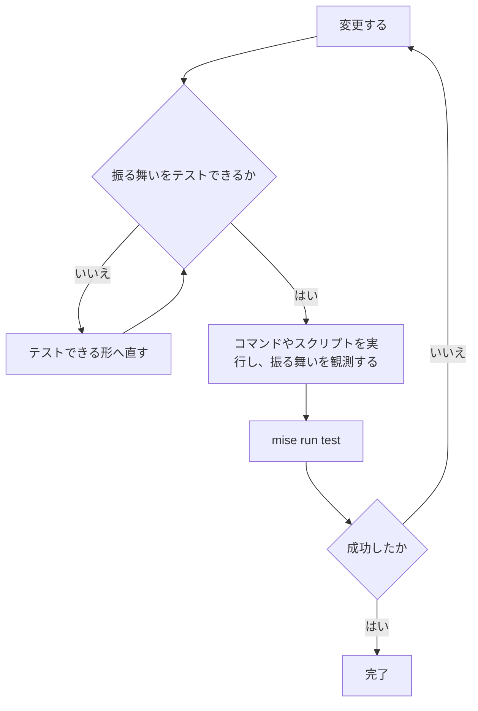

# AGENTS.md

管理境界、Bootstrap の原則、バージョンの固定方法は [docs/repo-map.md](docs/repo-map.md) を正本とする。
変更前は必ず [docs/operations.md](docs/operations.md) の手順を確認する。

## ファイル管理

- 手書きで管理するリソース列挙はアルファベティカルに保つ

## 検証

変更後は次の手順で契約テストを通す。

設定ファイルやソースの文面を直接検査するテストは書かない。

## Git と作業ファイル

- 作業ブランチは作らない。変更は `master` に直接コミットし、`master` を push する
- `README.md` は編集しない
