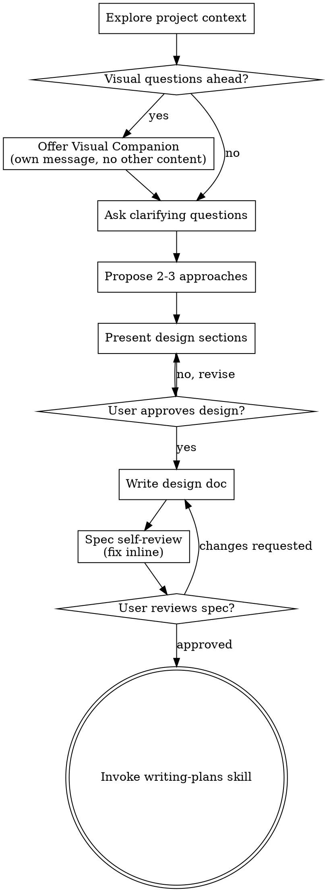

> [!NOTE]
> このファイルは `obra/superpowers` の `skills/brainstorming/SKILL.md` を日本語訳したものです。原文の著作権は Jesse Vincent に帰属し、原文は MIT License の下で提供されています。詳細はリポジトリ直下の `THIRD_PARTY_NOTICES.md` を参照してください。

# アイデアを設計に落とし込むブレインストーミング

自然な協働対話を通じて、アイデアを十分に形になった設計と仕様へと育てるのを支援する。

まず現在のプロジェクト文脈を理解し、その後、一度に一つずつ質問してアイデアを磨いていく。何を作るのか理解できたら、設計を提示し、ユーザーの承認を得る。

<HARD-GATE>
設計を提示してユーザーの承認を得るまでは、いかなる実装 skill も起動してはならないし、コードを書いたり、プロジェクトを scaffold したり、実装行為を取ってもならない。これは、どれほど単純に見えるプロジェクトであってもすべてに適用される。
</HARD-GATE>

## アンチパターン: 「これは設計が要るほど複雑じゃない」

すべてのプロジェクトはこのプロセスを通る。TODO リスト、単一関数ユーティリティ、設定変更、そのすべてだ。「単純な」プロジェクトこそ、未検証の思い込みによって最も無駄が生まれやすい。設計自体は短くてよいこともあるが、本当に単純なプロジェクトであっても、必ず提示して承認を取らなければならない。

## チェックリスト

これらの各項目について必ずタスクを作成し、順番に完了しなければならない:

1. **プロジェクト文脈を調べる** — ファイル、ドキュメント、最近のコミットを確認する
2. **Visual Companion を案内する**（話題に視覚的な質問が含まれる場合）— これは独立したメッセージであり、確認質問と組み合わせてはならない。下の Visual Companion 節を参照。
3. **確認質問をする** — 一度に一つずつ、目的、制約、成功条件を理解する
4. **2〜3 のアプローチを提案する** — トレードオフと推奨案を添える
5. **設計を提示する** — 複雑さに応じて節ごとに提示し、各節の後でユーザー承認を得る
6. **設計ドキュメントを書く** — `docs/superpowers/specs/YYYY-MM-DD-<topic>-design.md` に保存してコミットする
7. **仕様のセルフレビュー** — プレースホルダ、矛盾、曖昧さ、スコープを素早く inline で点検する（下記参照）
8. **ユーザーが書かれた仕様をレビューする** — 次へ進む前に仕様ファイルのレビューを依頼する
9. **実装へ移行する** — 実装計画を作るため `writing-plans` skill を起動する

## プロセスフロー

**終端状態は `writing-plans` の起動である。** `frontend-design`、`mcp-builder`、その他の実装 skill を起動してはならない。ブレインストーミングの後に起動する唯一の skill は `writing-plans` である。

## プロセス

**アイデアを理解する:**

- まず現在のプロジェクト状態を確認する（ファイル、ドキュメント、最近のコミット）
- 詳細な質問をする前にスコープを評価する: 依頼が複数の独立したサブシステムを記述しているなら（例: 「チャット、ファイル保存、課金、分析を持つプラットフォームを作る」）、すぐにそれを指摘する。先に分解が必要なプロジェクトの詳細を、質問で詰め始めてはならない。
- プロジェクトが単一仕様には大きすぎる場合、サブプロジェクトへの分解を支援する: 独立した要素は何か、それらはどう関係するか、どの順序で作るべきか。その後、最初のサブプロジェクトを通常の設計フローでブレインストーミングする。各サブプロジェクトはそれぞれ独自の spec → plan → implementation サイクルを持つ。
- 適切なスコープのプロジェクトについては、一度に一つずつ質問してアイデアを磨く
- 可能なら多肢選択式の質問を優先するが、自由回答でもよい
- 1 メッセージにつき質問は 1 つだけ。ある話題をさらに掘る必要があるなら、複数メッセージに分ける
- 理解に集中する: 目的、制約、成功条件

**アプローチを検討する:**

- 2〜3 個の異なるアプローチをトレードオフつきで提案する
- 推奨案とその理由を添えて会話的に選択肢を提示する
- 推奨案を先に出し、なぜそれを勧めるのか説明する

**設計を提示する:**

- 何を作るのか理解できたと思えたら、設計を提示する
- 各節の長さは複雑さに応じて調整する: 単純なら数文、繊細なら 200〜300 語程度まで
- 各節のあとに「ここまでで合っているか」を確認する
- 扱う内容: アーキテクチャ、コンポーネント、データフロー、エラーハンドリング、テスト
- 何かが腑に落ちなければ、戻って明確化する準備をしておく

**分離と明快さを意識して設計する:**

- システムを、明確な 1 つの目的を持ち、よく定義されたインターフェイスで通信し、独立して理解・テストできる小さな単位に分ける
- 各単位について、何をするのか、どう使うのか、何に依存するのか、に答えられなければならない
- 内部実装を読まなくてもその単位が何をするか理解できるか。内部実装を変えても利用者を壊さずに済むか。そうでないなら境界の切り方を見直す必要がある。
- 小さく境界の明確な単位は、自分自身にとっても扱いやすい。手元の文脈に収まるコードの方が推論しやすく、ファイルが責務に集中している方が編集は信頼できる。ファイルが大きくなってきたら、それは多くのことをやりすぎている合図であることが多い。

**既存コードベースで作業する:**

- 変更提案の前に、現在の構造を調べる。既存のパターンに従う。
- 既存コードに、その作業に影響する問題がある場合（例: ファイルが大きくなりすぎている、境界が不明瞭、責務が絡み合っている）、作業対象の設計に、それを改善するための狙いを絞った改善を含める。良い開発者が、触るコードをよりよくするのと同じである。
- 関連のないリファクタリングは提案しない。現在の目的に資するものに集中する。

## 設計の後

**ドキュメント化:**

- 検証済みの設計（spec）を `docs/superpowers/specs/YYYY-MM-DD-<topic>-design.md` に書く
  - （spec の保存場所に関するユーザーの好みがある場合は、このデフォルトを上書きする）
- 利用可能なら `elements-of-style:writing-clearly-and-concisely` skill を使う
- 設計ドキュメントを git にコミットする

**仕様のセルフレビュー:**
spec ドキュメントを書いたら、新鮮な目で見直す:

1. **プレースホルダ走査:** `"TBD"`、`"TODO"`、未完の節、曖昧な要件はないか。修正する。
2. **内部整合性:** 節同士で矛盾していないか。アーキテクチャは機能説明と一致しているか。
3. **スコープ確認:** これは単一の実装計画に十分集中しているか。それとも分解が必要か。
4. **曖昧さ確認:** 2 通りに解釈できる要件はないか。あるなら 1 つに決めて明示する。

問題があれば inline で修正する。再レビューは不要。そのまま直して先に進む。

**ユーザーレビューのゲート:**
spec レビューのループが通ったら、次へ進む前にユーザーに書いた spec をレビューしてもらう:

> "Spec written and committed to `<path>`. Please review it and let me know if you want to make any changes before we start writing out the implementation plan."

ユーザーの返答を待つ。変更依頼があれば反映し、spec レビューループを再実行する。ユーザーが承認するまでは先へ進まない。

**実装:**

- 詳細な実装計画を作るため `writing-plans` skill を起動する
- 他の skill を起動してはならない。次は `writing-plans` である。

## 主要原則

- **一度に一つの質問** - 複数質問で圧倒しない
- **多肢選択を優先** - 可能なら自由回答より答えやすい
- **YAGNI を徹底** - すべての設計から不要機能を削る
- **代替案を探る** - 2〜3 個のアプローチを常に提案してから決める
- **段階的に検証する** - 設計を提示し、承認を得てから進む
- **柔軟である** - 何かが腑に落ちなければ戻って明確化する

## Visual Companion

ブレインストーミング中に mockup、diagram、選択肢を見せるためのブラウザベースの companion。これは mode ではなく tool として使える。companion を受け入れるということは、視覚化が役立つ質問で使えるようになるという意味であり、すべての質問をブラウザ経由にするという意味ではない。

**companion を案内する:** これからの質問に視覚的コンテンツ（mockup、layout、diagram）が含まれそうなら、一度だけ同意を取る:
> "Some of what we're working on might be easier to explain if I can show it to you in a web browser. I can put together mockups, diagrams, comparisons, and other visuals as we go. This feature is still new and can be token-intensive. Want to try it? (Requires opening a local URL)"

**この案内は必ず独立したメッセージでなければならない。** 確認質問、文脈の要約、そのほかどんな内容とも組み合わせてはならない。メッセージには上の案内文だけを入れ、それ以外は含めない。ユーザーの返答を待ってから続行する。断られたら、テキストだけのブレインストーミングで進める。

**質問ごとの判断:** ユーザーが受け入れた後でも、各質問ごとにブラウザを使うか端末を使うか判断する。基準は **読むより見たほうがユーザーが理解しやすいか** である。

- **ブラウザを使う** のは、内容そのものが視覚的なとき — mockup、wireframe、layout 比較、architecture diagram、横並びの visual design など
- **端末を使う** のは、内容がテキストのとき — 要件質問、概念的な選択、トレードオフ一覧、A/B/C/D のテキスト選択肢、スコープ判断

UI に関する質問だからといって、自動的に visual question になるわけではない。「What does personality mean in this context?」は概念的な質問であり、端末を使う。「Which wizard layout works better?」は視覚的な質問であり、ブラウザを使う。

ユーザーが companion に同意したら、先へ進む前に詳細ガイドを読む:
`skills/brainstorming/visual-companion.md`
