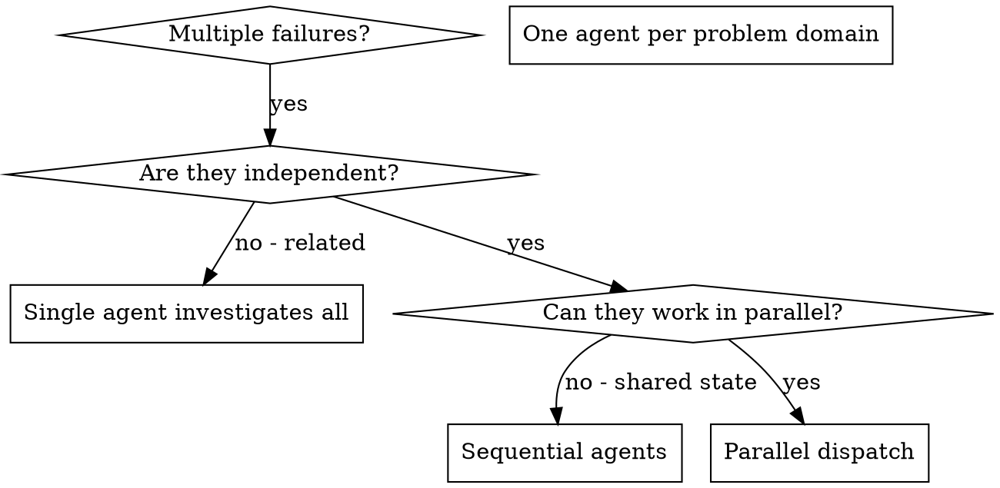

> [!NOTE]
> このファイルは `obra/superpowers` の `skills/dispatching-parallel-agents/SKILL.md` を日本語訳したものです。原文の著作権は Jesse Vincent に帰属し、原文は MIT License の下で提供されています。詳細は `THIRD_PARTY_NOTICES.md` を参照してください。

# 並列エージェントの dispatch

## 概要

隔離された文脈を持つ専門エージェントにタスクを委任する。指示と文脈を精密に組み立てることで、各エージェントが自分の課題に集中し、成功できるようにする。彼らがあなたのセッション文脈や履歴を継承してはならない。必要なものだけをあなたが構成して渡す。これにより、調整作業のための自分の文脈も温存できる。

無関係な failure が複数あるとき（異なる test file、異なる subsystem、異なる bug）、順番に調べるのは時間の無駄になる。各調査は独立しており、並行して進められる。

**中核原則:** 独立した問題領域ごとに 1 エージェントを dispatch する。同時並行で作業させる。

## 使うタイミング



**使うのは次のとき:**
- root cause が異なる 3 件以上の test file failure がある
- 複数の subsystem が独立して壊れている
- 各問題が、他の文脈なしで理解できる
- 調査間に shared state がない

**使ってはならないのは次のとき:**
- failure が関連している（1 つ直せば他も直るかもしれない）
- システム全体の状態を理解する必要がある
- エージェント同士が干渉しうる

## パターン

### 1. 独立した領域を特定する

何が壊れているかで failure を束ねる:
- File A tests: Tool approval flow
- File B tests: Batch completion behavior
- File C tests: Abort functionality

各領域は独立している。tool approval を直しても abort tests には影響しない。

### 2. 焦点の合ったエージェントタスクを作る

各エージェントに渡すもの:
- **具体的なスコープ:** 1 つの test file または subsystem
- **明確なゴール:** これらの test を pass させる
- **制約:** 他の code は変更しない
- **期待する出力:** 見つけたことと直したことの要約

### 3. 並列に dispatch する

```typescript
// In Claude Code / AI environment
Task("Fix agent-tool-abort.test.ts failures")
Task("Fix batch-completion-behavior.test.ts failures")
Task("Fix tool-approval-race-conditions.test.ts failures")
// All three run concurrently
```

### 4. レビューして統合する

エージェントが戻ってきたら:
- 各 summary を読む
- fix 同士が衝突していないか確認する
- full test suite を走らせる
- すべての変更を統合する

## エージェントプロンプトの構造

良いエージェントプロンプトは次の性質を持つ:
1. **焦点が絞られている** - 1 つの明確な問題領域
2. **自己完結している** - 問題を理解するために必要な文脈がすべてある
3. **出力が具体的** - エージェントは何を返すべきか

```markdown
Fix the 3 failing tests in src/agents/agent-tool-abort.test.ts:

1. "should abort tool with partial output capture" - expects 'interrupted at' in message
2. "should handle mixed completed and aborted tools" - fast tool aborted instead of completed
3. "should properly track pendingToolCount" - expects 3 results but gets 0

These are timing/race condition issues. Your task:

1. Read the test file and understand what each test verifies
2. Identify root cause - timing issues or actual bugs?
3. Fix by:
   - Replacing arbitrary timeouts with event-based waiting
   - Fixing bugs in abort implementation if found
   - Adjusting test expectations if testing changed behavior

Do NOT just increase timeouts - find the real issue.

Return: Summary of what you found and what you fixed.
```

## よくある失敗

**❌ 広すぎる:** "Fix all the tests" - エージェントが迷う  
**✅ 具体的:** "Fix agent-tool-abort.test.ts" - スコープが絞られている

**❌ 文脈がない:** "Fix the race condition" - どこなのか分からない  
**✅ 文脈がある:** error message と test 名を貼る

**❌ 制約がない:** エージェントが何でも refactor してしまう  
**✅ 制約がある:** "Do NOT change production code" または "Fix tests only"

**❌ 出力が曖昧:** "Fix it" - 何が変わったか分からない  
**✅ 具体的:** "Return summary of root cause and changes"

## 使ってはならないとき

**関連した failure:** 1 つ直すと他も直るかもしれない。まず一緒に調べる  
**全体文脈が必要:** 全システムを見ないと理解できない  
**探索的デバッグ:** 何が壊れているかまだ分かっていない  
**shared state:** エージェント同士が干渉する（同じ file を編集する、同じ resource を使う）

## セッションからの実例

**Scenario:** 大きな refactoring のあと、3 file にまたがって 6 件の test failure

**Failures:**
- agent-tool-abort.test.ts: 3 failures（timing issue）
- batch-completion-behavior.test.ts: 2 failures（tool が実行されない）
- tool-approval-race-conditions.test.ts: 1 failure（execution count = 0）

**Decision:** 独立した領域。abort logic、batch completion、race condition はそれぞれ別

**Dispatch:**
```
Agent 1 → Fix agent-tool-abort.test.ts
Agent 2 → Fix batch-completion-behavior.test.ts
Agent 3 → Fix tool-approval-race-conditions.test.ts
```

**Results:**
- Agent 1: timeout を event-based waiting に置き換えた
- Agent 2: event structure bug を修正した（threadId が誤った位置にあった）
- Agent 3: 非同期 tool 実行が終わるのを待つ処理を追加した

**Integration:** すべての fix は独立しており、衝突なし。full suite は green

**節約できた時間:** 3 問題を逐次ではなく並列で解いた

## 主な利点

1. **並列化** - 複数の調査が同時に進む
2. **集中** - 各エージェントのスコープが狭く、追う文脈が少ない
3. **独立性** - エージェント同士が干渉しない
4. **速度** - 3 つの問題を 1 つ分の時間で解く

## 検証

エージェントが戻った後:
1. **各 summary をレビューする** - 何が変わったか理解する
2. **衝突を確認する** - エージェント同士が同じ code を触っていないか
3. **full suite を走らせる** - すべての fix が一緒に機能するか確認する
4. **spot check する** - エージェントは系統的な誤りを作ることがある

## 現実の効果

デバッグセッション（2025-10-03）より:
- 3 file にまたがる 6 件の failure
- 3 エージェントを並列 dispatch
- すべての調査が同時並行で完了
- すべての fix を問題なく統合
- エージェント変更間の conflict は 0
