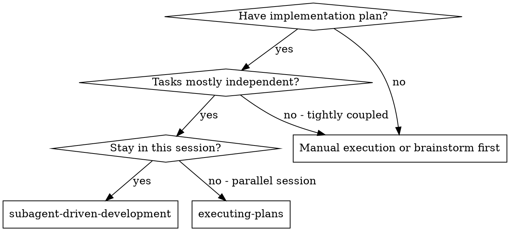
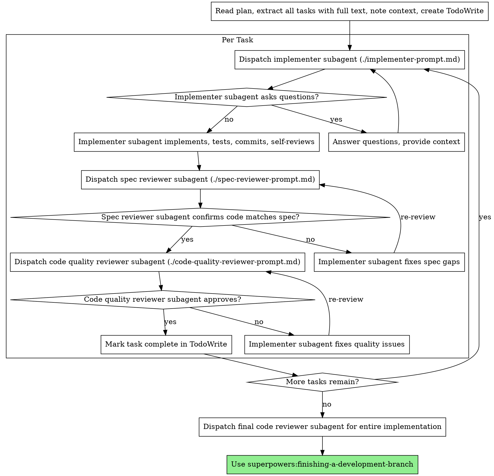

> [!NOTE]
> このファイルは `obra/superpowers` の `skills/subagent-driven-development/SKILL.md` を日本語訳したものです。原文の著作権は Jesse Vincent に帰属し、原文は MIT License の下で提供されています。詳細は `THIRD_PARTY_NOTICES.md` を参照してください。

# Subagent-Driven Development

plan を実行するために、task ごとに fresh な subagent を dispatch し、各 task の後で二段階 review を行う。順序は、まず spec compliance review、その後に code quality review。

**なぜ subagent を使うのか:** 隔離された文脈を持つ専門エージェントに task を委任する。指示と文脈を精密に作ることで、各エージェントが task に集中し、成功できるようにする。彼らがあなたの session 文脈や履歴を継承してはならない。必要なものだけをあなたが構成して渡す。これにより、調整作業のための自分の文脈も温存できる。

**中核原則:** task ごとに fresh な subagent + 二段階 review（spec → quality） = 高品質で高速な反復

## 使うタイミング



**vs. Executing Plans（parallel session）:**
- 同じ session に留まる（context switch がない）
- task ごとに fresh な subagent（context pollution がない）
- 各 task の後に二段階 review: まず spec compliance、その後に code quality
- より速い iteration（task の合間に human-in-loop を要しない）

## プロセス



## モデル選択

コストを抑え、速度を上げるために、各役割に対して扱える最も弱いモデルを使う。

**機械的な実装 task**（孤立した function、明確な spec、1〜2 file）には速く安いモデルを使う。plan が十分に具体的なら、実装 task の大半は機械的である。

**統合や判断を要する task**（複数 file の調整、pattern matching、debugging）には標準的なモデルを使う。

**アーキテクチャ、設計、レビュー task** には、利用可能な中で最も高性能なモデルを使う。

**task 複雑度のシグナル:**
- 1〜2 file に触れ、spec が完備している → 安価なモデル
- 複数 file に触れ、統合上の懸念がある → 標準モデル
- 設計判断や広い codebase 理解が必要 → 最も高性能なモデル

## Implementer Status の扱い

implementer subagent は 4 つの status のいずれかを報告する。適切に扱うこと:

**DONE:** spec compliance review に進む。

**DONE_WITH_CONCERNS:** implementer は作業自体は完了したが、疑問点を挙げている。先へ進む前に concern を読む。concern が correctness や scope に関わるなら review 前に対処する。単なる観察（例: "this file is getting large"）なら記録して review に進む。

**NEEDS_CONTEXT:** 提供されていない情報が必要。欠けている文脈を渡して再 dispatch する。

**BLOCKED:** implementer は task を完了できない。blocker を評価する:
1. 文脈不足が原因なら、より多くの context を与えて同じ model で再 dispatch する
2. より強い推論が必要なら、より高性能な model で再 dispatch する
3. task が大きすぎるなら、より小さく分割する
4. plan 自体が誤っているなら human に escalation する

implementer の escalation を**決して無視してはならない**し、変更なしに同じ model へ再試行させてはならない。implementer が stuck だと言うなら、何かを変える必要がある。

## Prompt Template

- `./implementer-prompt.md` - implementer subagent を dispatch
- `./spec-reviewer-prompt.md` - spec compliance reviewer subagent を dispatch
- `./code-quality-reviewer-prompt.md` - code quality reviewer subagent を dispatch

## Workflow 例

```
You: I'm using Subagent-Driven Development to execute this plan.

[Read plan file once: docs/superpowers/plans/feature-plan.md]
[Extract all 5 tasks with full text and context]
[Create TodoWrite with all tasks]

Task 1: Hook installation script

[Get Task 1 text and context (already extracted)]
[Dispatch implementation subagent with full task text + context]

Implementer: "Before I begin - should the hook be installed at user or system level?"

You: "User level (~/.config/superpowers/hooks/)"

Implementer: "Got it. Implementing now..."
[Later] Implementer:
  - Implemented install-hook command
  - Added tests, 5/5 passing
  - Self-review: Found I missed --force flag, added it
  - Committed

[Dispatch spec compliance reviewer]
Spec reviewer: ✅ Spec compliant - all requirements met, nothing extra

[Get git SHAs, dispatch code quality reviewer]
Code reviewer: Strengths: Good test coverage, clean. Issues: None. Approved.

[Mark Task 1 complete]

Task 2: Recovery modes

[Get Task 2 text and context (already extracted)]
[Dispatch implementation subagent with full task text + context]

Implementer: [No questions, proceeds]
Implementer:
  - Added verify/repair modes
  - 8/8 tests passing
  - Self-review: All good
  - Committed

[Dispatch spec compliance reviewer]
Spec reviewer: ❌ Issues:
  - Missing: Progress reporting (spec says "report every 100 items")
  - Extra: Added --json flag (not requested)

[Implementer fixes issues]
Implementer: Removed --json flag, added progress reporting

[Spec reviewer reviews again]
Spec reviewer: ✅ Spec compliant now

[Dispatch code quality reviewer]
Code reviewer: Strengths: Solid. Issues (Important): Magic number (100)

[Implementer fixes]
Implementer: Extracted PROGRESS_INTERVAL constant

[Code reviewer reviews again]
Code reviewer: ✅ Approved

[Mark Task 2 complete]

...

[After all tasks]
[Dispatch final code-reviewer]
Final reviewer: All requirements met, ready to merge

Done!
```

## 利点

**vs. Manual execution:**
- subagent は自然に TDD に従う
- task ごとに fresh context（混乱がない）
- parallel-safe（subagent 同士が干渉しない）
- subagent は質問できる（作業前だけでなく作業中も）

**vs. Executing Plans:**
- 同じ session 内で進む（handoff がない）
- 継続的に進行する（待ち時間がない）
- review checkpoint が自動化される

**効率面の利得:**
- file 読み込みの overhead がない（controller が全文を渡す）
- controller が必要な文脈を厳選して渡す
- subagent は upfront に完全な情報を受け取る
- 作業開始前に質問が表面化する（後からではなく）

**品質ゲート:**
- self-review が handoff 前の問題を拾う
- 二段階 review: spec compliance、次に code quality
- review loop によって fix が実際に効いたことを確認する
- spec compliance が過不足のある実装を防ぐ
- code quality が実装の作りを担保する

**コスト:**
- subagent invocation が増える（task ごとに implementer + 2 reviewer）
- controller 側の準備作業が増える（全 task を upfront に抽出）
- review loop が iteration を増やす
- ただし問題を早く捕まえる（後から debug するより安い）

## Red Flags

**絶対にしてはならない:**
- user の明示的同意なしに main/master branch で実装を始める
- review を飛ばす（spec compliance も code quality も）
- 未修正 issue を抱えたまま進む
- 複数の implementation subagent を並列 dispatch する（conflict する）
- subagent に plan file を読ませる（全文を渡す）
- scene-setting の文脈を省く（subagent は task の位置づけを理解する必要がある）
- subagent の質問を無視する（先に答える）
- spec compliance で "close enough" を受け入れる（issue があれば未完）
- review loop を飛ばす（reviewer が issue を出したら fix → 再 review）
- implementer の self-review で実レビューを置き換える（両方必要）
- **spec compliance が ✅ になる前に code quality review を始める**（順序が誤り）
- どちらかの review に未解決 issue があるまま次の task に進む

**subagent が質問した場合:**
- 明確かつ完全に答える
- 必要なら追加 context を渡す
- 急かして実装させない

**reviewer が issue を見つけた場合:**
- implementer（同じ subagent）が修正する
- reviewer が再 review する
- 承認されるまで繰り返す
- 再 review を飛ばさない

**subagent が task に失敗した場合:**
- fix 用 subagent を具体的指示つきで dispatch する
- 手作業で直そうとしない（context pollution）

## 統合

**必須の workflow skill:**
- **superpowers:using-git-worktrees** - 必須: 開始前に isolated workspace をセットアップする
- **superpowers:writing-plans** - この skill が実行する plan を作る
- **superpowers:requesting-code-review** - reviewer subagent 用の code review template
- **superpowers:finishing-a-development-branch** - すべての task 後に開発を完了する

**subagent が使うべきもの:**
- **superpowers:test-driven-development** - subagent は各 task で TDD に従う

**代替 workflow:**
- **superpowers:executing-plans** - 同 session 実行ではなく parallel session に使う
