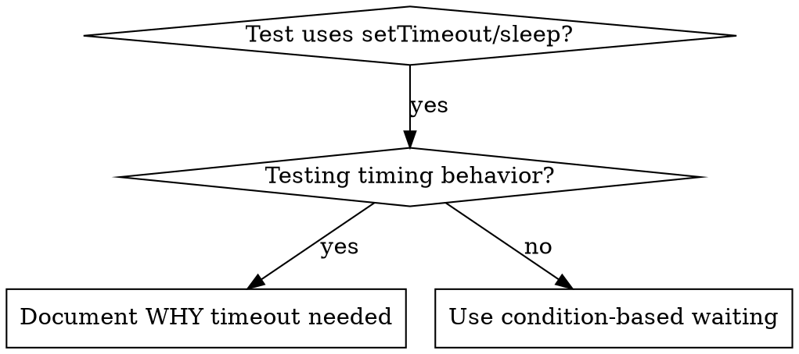

> [!NOTE]
> このファイルは `obra/superpowers` の `skills/systematic-debugging/condition-based-waiting.md` を日本語訳したものです。原文の著作権は Jesse Vincent に帰属し、原文は MIT License の下で提供されています。詳細は `THIRD_PARTY_NOTICES.md` を参照してください。

# Condition-Based Waiting

## 概要

flaky test は、任意の delay で timing を推測しがちである。これにより race condition が生まれ、高速な machine では通るが、負荷下や CI では落ちる。

**中核原則:** どれくらい時間がかかるかの推測ではなく、本当に待ちたい condition を待つ。

## 使うタイミング



**使うのは次のとき:**
- test に任意の delay（`setTimeout`、`sleep`、`time.sleep()`）がある
- test が flaky（たまに通り、負荷下で落ちる）
- 並列実行で timeout する
- async operation の完了待ちをしている

**使ってはならないのは次のとき:**
- timing behavior 自体を test している（debounce、throttle interval）
- 任意 timeout を使うなら、必ず WHY を文書化する

## 中核パターン

```typescript
// ❌ BEFORE: Guessing at timing
await new Promise(r => setTimeout(r, 50));
const result = getResult();
expect(result).toBeDefined();

// ✅ AFTER: Waiting for condition
await waitFor(() => getResult() !== undefined);
const result = getResult();
expect(result).toBeDefined();
```

## Quick Pattern

| Scenario | Pattern |
|----------|---------|
| event を待つ | `waitFor(() => events.find(e => e.type === 'DONE'))` |
| state を待つ | `waitFor(() => machine.state === 'ready')` |
| count を待つ | `waitFor(() => items.length >= 5)` |
| file を待つ | `waitFor(() => fs.existsSync(path))` |
| 複雑な condition | `waitFor(() => obj.ready && obj.value > 10)` |

## 実装

generic な polling function:
```typescript
async function waitFor<T>(
  condition: () => T | undefined | null | false,
  description: string,
  timeoutMs = 5000
): Promise<T> {
  const startTime = Date.now();

  while (true) {
    const result = condition();
    if (result) return result;

    if (Date.now() - startTime > timeoutMs) {
      throw new Error(`Timeout waiting for ${description} after ${timeoutMs}ms`);
    }

    await new Promise(r => setTimeout(r, 10)); // Poll every 10ms
  }
}
```

実際の debugging session で使われた domain-specific helper（`waitForEvent`、`waitForEventCount`、`waitForEventMatch`）を含む完全版は、この directory の `condition-based-waiting-example.ts` を参照する。

## よくある失敗

**❌ Polling が速すぎる:** `setTimeout(check, 1)` - CPU を浪費する  
**✅ 修正:** 10ms ごとに poll する

**❌ Timeout がない:** condition が満たされなければ無限 loop  
**✅ 修正:** 明確な error つき timeout を常に含める

**❌ stale data:** loop 前に state を cache する  
**✅ 修正:** fresh data を得るため getter は loop 内で呼ぶ

## 任意 Timeout が正しい場合

```typescript
// Tool ticks every 100ms - need 2 ticks to verify partial output
await waitForEvent(manager, 'TOOL_STARTED'); // First: wait for condition
await new Promise(r => setTimeout(r, 200));   // Then: wait for timed behavior
// 200ms = 2 ticks at 100ms intervals - documented and justified
```

**要件:**
1. まず trigger condition を待つ
2. 既知の timing に基づいていること（推測ではない）
3. WHY を説明する comment があること
