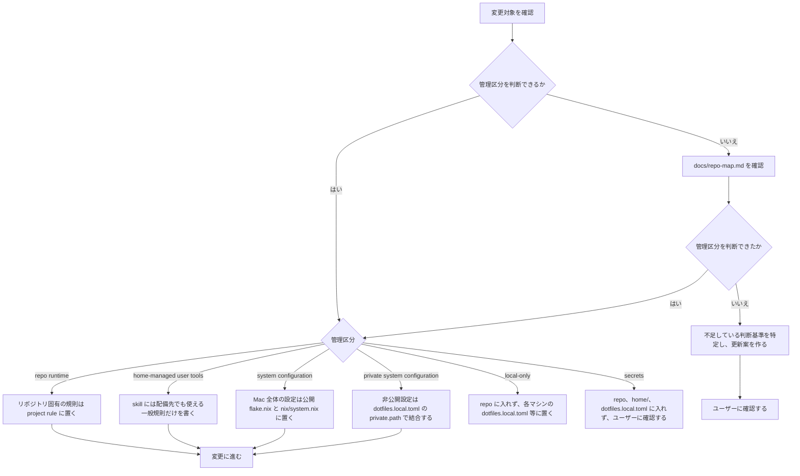
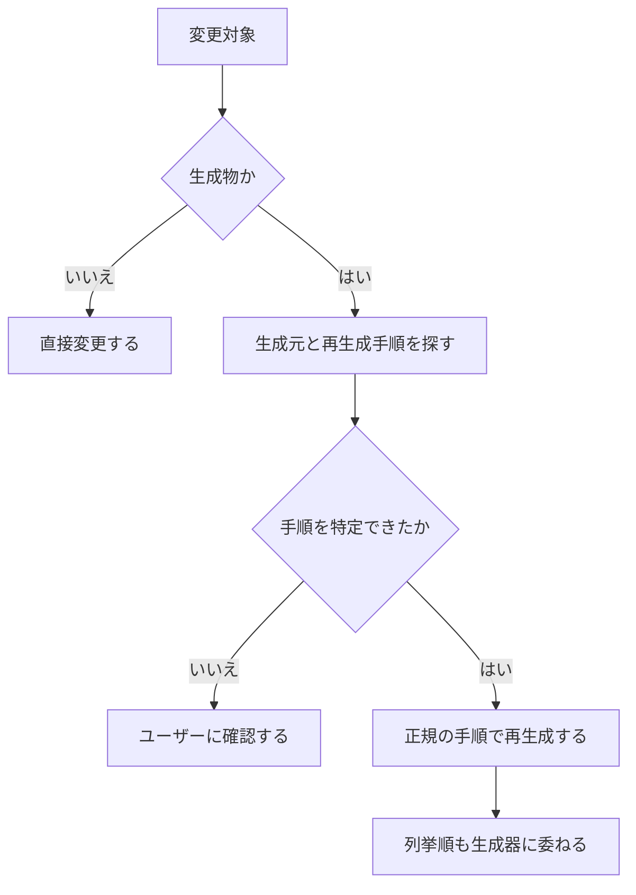

# 運用ガイド

macOS 環境を前提とする。管理境界は [repo-map.md](repo-map.md) の「管理境界」で定義された内容に従う。

## 変更前の確認

変更に着手する前に、管理区分を次の順序で確定する。



### 生成物

`apm.lock.yaml`、`flake.lock`、`nix/localllm/uv.lock` などの生成物は手動で編集しない。
固定ファイルの更新は開発時のみ意図的に行い、`plan` や `apply` の実行中に自動更新されることはない。

flake.lock は上流の inputs やリビジョンを固定するものであり、選択された cask の一覧を記録するものではないため、既存パッケージの選択・解除のみで更新する必要はありません。

| トリガー | コマンド |
| --- | --- |
| flake inputs の追加・変更 | `nix flake lock` ([公式ドキュメント](https://docs.lix.systems/manual/lix/nightly/command-ref/new-cli/nix3-flake-lock.html)) |
| nixpkgs など固定された input の意図的な更新 | `nix flake update nixpkgs` ([公式ドキュメント](https://docs.lix.systems/manual/lix/nightly/command-ref/new-cli/nix3-flake-update.html)) |
| スキル依存の追加・削除・更新 | 対応する `dotfiles agents install`、`uninstall`、`update` および生成される `home/apm.lock.yaml` |



## 初回セットアップ

```sh
curl -fsSL https://dot.9sako6.com | sh
```

公開リポジトリ直下の `flake.nix` が唯一の構成ルートである。
Home Manager は nix-darwin のモジュールとして組み込まれているため、システムと通常のホーム設定は同一の `apply` で反映する。
`dotfiles.toml` の `copy` 対象は、システム反映の成功後に Rust CLI が `$HOME` へ実体として配備する。

Home Managerの配備先に既存ファイルがある場合は、`.pre-home-manager` 接尾辞を付与して退避される。
`curl | sh` の実行時は、確認の入力のみを制御端末から読み取り、ダウンロード中のスクリプトを入力値として消費しない。

## 日常コマンド

システムの確認・反映、設定の一覧、エージェント管理のコマンドは[CLIのUsage](../cli/README.md#usage)を参照してください。個別の説明は[settings](../cli/README.md#settings)と[agents](../cli/README.md#agents)にあります。

`dotfiles settings`

dotfiles settingsの既存一覧の下にpackages、system、services、agentsを追加しました。稼働状態の照合やシステム構築・反映、lock更新は行わず、宣言構成から一覧JSONをNix storeへ生成します。入力が同一ならNix標準の評価・ビルドキャッシュを再利用します。

settingsは端末実行とパイプ処理のいずれにおいても全画面表示やスクロール操作を行わず、全一覧の取得と整形が完了してから標準出力にまとめて一度だけ出力して終了します。packagesはname、manager、currentの3列で構成され、currentには宣言バージョン（固定のないHomebrewは—）を表示し、最新バージョンの照会と列は廃止された。

packagesにはHome Managerとenvironment.systemPackagesの宣言バージョン（Lix、zundamonotify、dotfiles CLIを含む）を表示する。名前・管理方式・版が一致する重複をまとめ、バージョン情報のない補助ラッパーを除外する。systemには、Nixのガベージコレクション自動実行や削除条件の引数、Homebrewの自動更新・パッケージ更新・宣言外パッケージ削除方針の有効値を表示する。旧範囲の世代との比較では、既存のネイティブ差分へフォールバックして架空の追加扱いを避ける。

リソース宣言の差分はsettingsと同様の表形式で表示され、追加は緑の`+`、削除は赤の`-`で示されます。copyリソースは変更が生じる対象のみハッシュ値とともにdeployment表へ表示します。宣言一覧が同一でもシステム世代が異なる場合は前後のrevision（またはビルド識別子）を出力し、CLI自身の更新なども確認できます。過去世代と比較できない場合は、従来のNixやHomebrewの差分を併記します。Night Shiftや音声入力ショートカットの設定は、`nix/macos-settings.nix`の共通宣言を反映し、一覧からも参照されます。

変更がない場合、planとapplyは差分表示や確認を行わずに正常終了する。変更がある場合は差分を標準出力に一度だけ出力し、applyのみ表示後にyesの確認を行う。

`apply`は差分がある場合のみyesの入力を求め、確認後は通常のnix-darwin activation全体とhome copyを実行します。実行直前に構成入力のスナップショットとアクティブ世代を再検証し、表示時点からの状態変化や競合を検出した場合は処理を中断します。外部への最新情報の照会は行われません。

公開リポジトリの更新には通常のGit操作を使います。

```sh
git pull
```

その他の補助タスクは `mise tasks` で一覧できる。mise 本体の状態確認には `mise ls --missing` や `mise prune --tools` などの標準コマンドを使用する。

ユーザー単位の常設ツールは Nix 管理を原則とし、新規ツールを mise の `[tools]` に追加しない。既存の mise 管理ツールを更新する際は、Nix へ移行可能かを事前に確認し、合理的に移行できる場合は `nix/packages.nix` と Home Manager へ移す。mise に残すのは Nix で合理的に管理できない例外のみとし、その理由を設定から判別できる状態を維持する。

公開構成の flake ルートはリポジトリ直下の `flake.nix` および `flake.lock` である。Nix で宣言するシステムやホーム設定は `nix/`、共有設定ファイルの実体は `home/` に配置する。

通常の設定ファイルや `.config`、`.zsh.d`、`mybin` は、稼働中のリポジトリへの直接のシンボリックリンクとし、編集内容を即座に反映させる。
devcontainerから参照するエージェント用設定の実体配備は、CLIの[copy](../cli/README.md#copy)を参照してください。対象パスの制約、ディレクトリ配下の同期範囲、Home Managerとの重複検査、権限の扱いを説明しています。

## CLI のビルドキャッシュ

`.github/workflows/cache-cli.yml` は、`master` への push または手動実行時に macOS arm64 上で Lix をセットアップし、`.#dotfiles` をビルド（Rust の 26 テストを含む）します。CLI の version と `GITHUB_SHA` の一致を検証後、公開 CLI と実行時依存のみを [Cachix](https://docs.cachix.org/getting-started) へ [push](https://docs.cachix.org/pushing) します。Cachix 1.11.1 は root flake の `.#cachix` から取得し、`nix build` や `run` では `--no-update-lock-file` および `--no-write-lock-file` で固定ファイル更新を禁止しています。なお、本ワークフローのアップロード対象に private 構成を含むシステム世代や LLM モデルは含めません。

### 必要な設定

1. Cachix で公開 cache を作成します。
2. cache 限定書き込み token を GitHub Actions secret の `CACHIX_AUTH_TOKEN`、cache 名を Actions variable の `CACHIX_CACHE_NAME` に登録します（token を公開ファイルへ書かないでください）。
3. 利用者固有のCachix cache URLと公開鍵は、`dotfiles.local.toml` の `private.path` で結合する非公開側 `darwinModules.default` 内の `nix.settings.substituters` および `nix.settings.trusted-public-keys` に追加してください。その際、既定のNix公式キャッシュは保持したまま追記し、設定完了後に `dotfiles apply` を実行して変更を反映します。

導入後は、CI で公開済みで同一入力となる CLI をキャッシュから取得します。未公開コミット、未コミット変更を含む作業ツリー、CI 完了前などのキャッシュ未登録時はローカルビルドされます。Nix 評価と Homebrew 状態確認はローカルに残ります。

公開・非公開・ローカル設定の入力が同一であればローカルのNix評価キャッシュを再利用し、入力変更時やキャッシュ削除時には再評価を行います。評価キャッシュの外部アップロードはなく、Cachixは公開CLI成果物の配信にのみ利用されます。なお、キャッシュ利用時であってもHomebrew状態の確認、copy計画の策定、およびapply直前の入力検証は毎回必ず実施されます。

## 設定ファイル仕様 (dotfiles.toml / dotfiles.local.toml)

設定項目、既定値、マージ規則、設定例はCLIの[設定ファイル](../cli/README.md#設定ファイル)を参照してください。

## 反映ライフサイクルとソース管理

入力の扱いはCLIの[実行対象の選択](../cli/README.md#実行対象の選択)、反映順序と整合性の設計は[設計文書](repo-map.md#cli-と評価反映の整合性)を参照してください。失敗時は[ロールバック](#ロールバック)の手順で復旧します。

## ロールバック

システムを直前の正常な世代に戻す場合は、以下のコマンドを実行する。

```sh
mise run system:rollback
sudo darwin-rebuild switch --rollback
```

ロールバック時の注意点:
- 反映失敗時に途中で停止した場合、結果記録シンボリックリンクは前世代を指しているが、システムや Homebrew に部分的な変更が残されている可能性がある。
- システム世代を戻した後、実体配備したホームファイルを復元するには、過去のコミット済みチェックアウトを明示的に指定して適用する。
- ソース記録シンボリックリンクの差し戻しや整合性の確認は、システムとホームの復元が検証された後にのみ行う。
- 過去世代の固定ファイルおよびビルドキャッシュは破棄せず保持しなければならない。

Nix のガベージコレクションは日本時間で毎日 0:00 に実行され、2日を超えた古い世代を削除する。
手動で `nix-collect-garbage` を実行する場合も、ロールバックに必要な世代が含まれていないことを事前に確認する。

## ローカル LLM と OpenCode (localllm)

macOS 27環境においてNix版OpenCode 1.18.13がコード署名不正によりSIGKILLで終了する事象に対応するため、設定検査の失敗時に終了コードおよびシグナル名を表示するよう改修するとともに、Darwin用ビルドで実行前に再署名を行い署名後のstripを停止する修正（[nixpkgs PR #550458](https://github.com/NixOS/nixpkgs/pull/550458)）をバックポート適用しました。

ローカルLLMの有効化とモデル指定はCLIの[localllm設定](../cli/README.md#localllm)を参照してください。設定が無効でも、開発・検証目的で`nix build .#localllm`を明示的に実行するとパッケージをビルドします。以前に取得したモデルデータは無効化だけでは削除されず、不要になったストアパスは後続のNixガベージコレクションで回収されます。

新しく導入されるモデルID `qwen3.8-9b-distill-4bit` は、Qwen3.5-9BをベースとしたEmperoの `Qwen3.8-9B-Distill` について、[配布元](https://huggingface.co/PocketAiHub/Qwen3.8-9B-MLX) が公開している4bit変換版を採用した非公式蒸留モデルです。動作環境は既存の `mlx-vlm` 0.7.0 を用い、取得時のバージョンおよびファイルハッシュはカタログで固定して管理されます。

利用するモデルの選択は、`dotfiles.local.toml` 内の `localllm.models` に1件のみを記述し、`localllm.default_model` にも同じIDを指定して行います。初回取得データ量の目安は新モデルが約6GB、引き続き選択可能な従来の `qwen3.8-27b-4bit` が約16GBです。なお、これらはストレージ取得時の容量であり、実際の運用時にはモデルの重みに加えて会話処理等の作業メモリが別途必要となります。

モデル推論バックエンドは `nix/packages.nix` が実装を所有し、[uv2nix](https://pyproject-nix.github.io/uv2nix/usage/getting-started.html) と `nix/localllm/uv.lock` により mlx-vlm 0.7.0 および MLX 0.32.2 の Metal 向け wheel に固定されており、実行時のパッケージ追加は行わない。動作検証としては、Apple Silicon 向けの qwen3.8-27b-4bit と qwen3.8-9b-distill-4bit の両モデルにおいて、合成した機密でない入力を用いて Metal 推論および OpenCode を通したファイル作成・読み取りの動作を確認しているほか、9B モデルでも実際に bash ツール経由でのファイル書き込みと読み取りが動作している。

サーバーはメモリを抑えるためKVキャッシュ4bit、prefill 64トークン、同時リクエスト1件とし、システムのGPUメモリ上限や常駐アプリの状態は変更しません。そのため、長い入力では応答までに数分かかることがあります。

`localllm chat` では、TUI入力欄へのログ混入を防ぐため、推論サーバーの標準出力および標準エラー出力を専用データ領域の `server.log` に書き込みます。ログファイルは起動ごとに上書きされ、起動時にそのパスが端末に表示されます。なお、単体起動の `localllm serve` では従来通り端末へ直接ログを出力します。

localllmのOpenCodeに通知する会話上限について、長文の早期要約を避けるためモデル設定に合わせて262,144トークンへと拡張しました。なお、1回あたりの回答上限は1,024トークンのまま維持しています。

localllm専用のprogress-instructions.mdをNixに同梱し、OpenCodeのinstructionsから追加で読み込む構成を追加しました。これにより、初回のツール呼び出し前における作業説明や有意な結果が得られた後の発見と次の手順の日本語報告、同一応答内でのツール呼び出し実行、および実際の結果に基づく作業報告を指示しています。

@prevalentware/opencode-goal-plugin 0.1.49を採用し、Nixでバージョンとソースハッシュを固定するとともに、依存関係（effect、zod、間接依存）をnix/localllm/goal-plugin/package-lock.jsonにより固定してビルド時にバンドル化しているため、起動時の追加取得は発生しません。「/goal <目的>」でのタスク開始、「/goal」での進捗確認、「/pause_goal」「/resume_goal」による一時停止・再開に対応しています。目的は専用の永続データ領域に保存され、会話要約後のコンテキスト引き継ぎおよび自律的な自動続行が可能です。

Nix管理のユーザーツールに `FFmpeg 8.1.2` を追加し、`ffmpeg` および `ffprobe` を提供します。`dotfiles apply` の実行後は `localllm chat` 上から通常のコマンド名でそのまま実行でき、他の既存コマンドと同様に `PATH` 経由で連携して利用できます。

- **実行コマンド:**
  - `localllm chat -- <opencode-arguments>` (プロンプト実行引数を渡す)
  - `localllm serve` (推論サーバーの単独起動)
  - `localllm check` (Metal 演算のみを確認)
- **実行特性:**
  - 常駐デーモンは存在せず、オンデマンドで単一の所有プロセスツリーとして起動する。
  - 外部ネットワークからの接続を受け付けないローカル接続用のアドレスにバインドする。
  - 初回ビルド時または初回取得時には、数 GB のモデルデータ取得が発生し得る旨が事前に通知される。
- **リソースの回収:**
  - `localllm` を無効化（`enabled = false`）した構成一式には、LLM 固有の依存関係は一切含まれない。
  - 使用されなくなったモデルデータは後続の Nix ガベージコレクションによって削除されるが、他の構成と共有されている基本依存関係は維持される。
- **OpenCode 統合とセキュリティ制限:**
  - OpenCode 1.18.13をベースとし、専用のXDG設定および履歴領域を割り当てています。Nix管理下のGoalプラグインのみを有効化し、外部プラグイン、外部スキル、ユーザー定義MCP、会話共有機能、外部プロバイダへの自動切替はすべて無効化しています。クライアントは起動元のPATH、HOME、ツール用環境変数を継承しつつOpenCode固有の環境変数を専用設定で置換し、推論サーバーは最小限の独立環境として分離・運用しています。
  - 推論サーバーは `sandbox-exec` により外向き通信を遮断し、ローカル接続専用の構成を維持します。`OpenCode` 本体および起動される子コマンドはネットワーク接続が可能で、`webfetch` および `websearch` を許可しています。今回のランチャーにより `OPENCODE_ENABLE_EXA=1` が設定され、APIキー不要の[組み込みExa検索](https://opencode.ai/docs/tools/#websearch)が自動的に有効になります。推論はローカルで実行しますが、検索語やアクセス先URL、ツール経由で送信する内容は外部へ送信されます。完全な通信遮断状態ではありません。
  - 自動テストでは、ローカルサーバー不在時における適切な失敗、クラウド推論への自動切り替えが発生しないこと、ユーザーPATH上のコマンド実行とHOME環境の引き継ぎ、Web取得および検索ツールの利用可能性、推論サーバーの外向き通信遮断を検証します。なお、CI上では巨大モデルの展開やGPUによる推論実行は行いません。

## 検証

変更した振る舞いはコマンドやスクリプトを用いて観測する。リポジトリ全体を検証する際はラッパーを挟まず、CI と同一のテストコマンドを直接実行する。

```sh
bun install --frozen-lockfile
bun run tsc --noEmit
bun test ./tests ./home/.apm/skills/anki/tools/*.test.ts
cargo fmt --check --manifest-path cli/Cargo.toml
cargo clippy --locked --manifest-path cli/Cargo.toml --all-targets -- -D warnings
cargo test --locked --manifest-path cli/Cargo.toml
nix build --no-link .#checks.aarch64-darwin.composition .#checks.aarch64-darwin.configuration .#checks.aarch64-darwin.modelFetch
opencode_package="$(nix build --no-link --print-out-paths .#localllmClient)"
goal_plugin="$(nix build --no-link --print-out-paths .#localllmGoalPlugin)"
DOTFILES_TEST_OPENCODE="$opencode_package/bin/opencode" DOTFILES_TEST_GOAL_PLUGIN="$goal_plugin" python3 -m unittest discover -s nix/localllm -p 'test_*.py'
python3 -m unittest discover -s nix/tests -p 'test_*.py'
nix build --no-link --offline .#checks.aarch64-darwin.modelFetch
```

- `nix build` によるテストでは、固定ハッシュを持つ小さなテスト用データを用いてモデル取得ロジックを検証し、反復ビルド時のキャッシュ動作を確認する。
- 純粋なシステム評価テストとして `nix eval --raw .#darwinConfigurations.current.system.drvPath` を実行し、テスト用ユーザー設定を用いてローカルの非純粋性を排除した評価が通ることを検証する。
- 依存固定ファイルの更新は開発時のみ明示的に行い、以下のコマンドを使用する。
  - `uv lock --project nix/localllm`
  - `nix flake lock`

設定ファイルやソースコードの文面そのものを直接検査するテストは作成しない。

## 変更前後の基本手順

1. 上の手順で管理区分を確定
2. `home-managed user tools` や構成を変更する場合は、[plan](../cli/README.md#plan)でHome Manager、パッケージ差分、およびcopy対象を確認
3. 必要な変更を入れる
4. 「検証」の手順を実施
5. 変更した管理区分に応じて反映
   - `home-managed user tools` — [apply](../cli/README.md#apply)
   - `system configuration` — [apply](../cli/README.md#apply)
   - `private system configuration` — [ローカル設定](../cli/README.md#設定ファイル)を更新し[apply](../cli/README.md#apply)

`repo runtime` の変更に対する反映コマンドはない。

Homebrew 本体は nix-homebrew、formula と cask は nix-darwin、通常のホームディレクトリ設定は Home Manager、devcontainer から参照可能な copy 対象は Rust CLI がそれぞれ管理する。

GitHub-hosted な macOS runner では、Home Manager のユーザー反映とシステム派生のビルドを個別に検証し、nix-darwin のシステム反映は実施しない。Nix ストアのパスは GitHub Actions のバイナリキャッシュを活用してワークフロー間で再利用する。新規 Mac への反映検証は、Homebrew の入っていない VM または実機で確認する。
