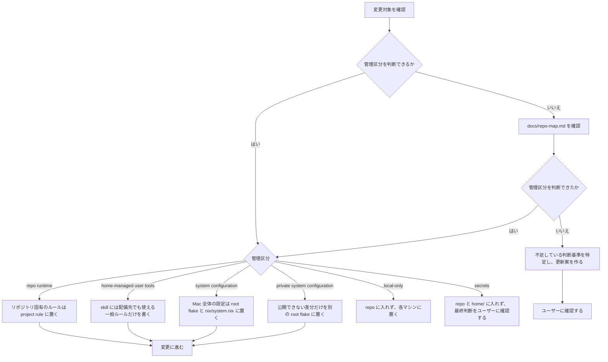
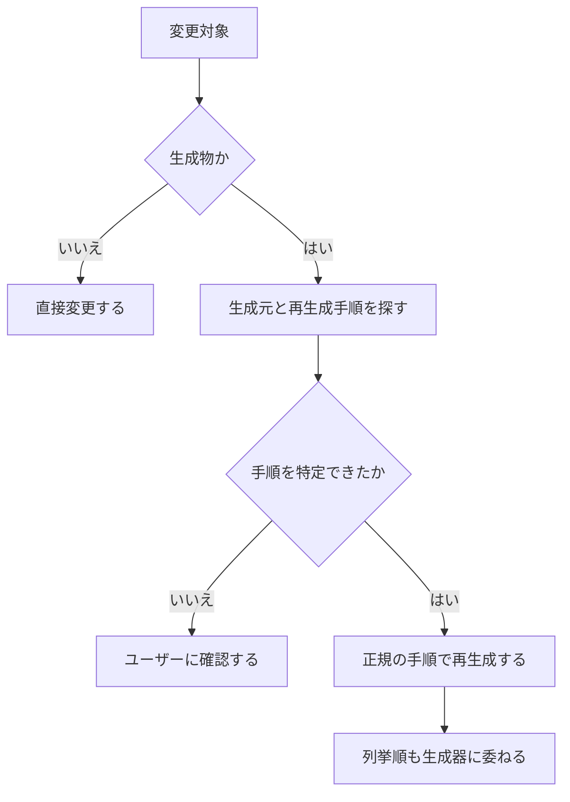

# 運用ガイド

macOS 前提。管理境界は [repo-map.md](repo-map.md) の「管理境界」を正本とする。

## 変更前の確認

変更前は、管理区分を次の順で確定する。



### 生成物

`apm.lock.yaml` などの生成物は手で編集しない。



## 初回セットアップ

```sh
curl -fsSL https://dot.9sako6.com | sh
```

Home Manager は nix-darwin module として組み込まれているため、system と通常の home 設定は同じ `apply` で反映する。
`.dotfiles.json` の `copy` 対象は system activation が成功した後に Rust CLI が `$HOME` へ実体配備する。
旧 home deployer から初めて移行するとき、Home Manager が管理する既存ファイルとの衝突は `.pre-home-manager` suffix へ退避される。
`curl | sh` では確認入力だけを制御端末から読み、download 中の script を回答として消費しない。

## 日常コマンド

```sh
git pull                       # 公開dotfilesを通常のGit操作で更新
dotfiles apply                 # system + homeを確認して反映
dotfiles plan                  # system + homeのplanを表示
dotfiles test                  # 契約テストとRustテストを実行
mise run system:rollback       # 直前のnix-darwin世代へ戻す
```

`apply` と `test` は mise task として公開しない。日常操作の正本は Rust 製の `dotfiles` CLI とする。
その他の task は `mise tasks` で一覧できる。mise 自体の状態確認は `mise ls --missing` や `mise prune --tools` などの標準コマンドを使う。

公開構成の flake root は repository root の `flake.nix` / `flake.lock`。Nix で宣言する system / home 設定は `nix/`、共有設定ファイルの実体は `home/` に置く。

通常の設定ファイルと `.config`、`.zsh.d`、`mybin` は live dotfiles checkout への out-of-store link にして、編集を即時反映する。
一方、devcontainer から読む agent resources は symlink にしない。repository root の `.dotfiles.json` に列挙した `.agents/skills`、`.claude/rules`、`.claude/settings.json`、`.claude/skills`、`.codex/AGENTS.md` を `$HOME` へ実体コピーする。これにより host 側の `/nix/store` や `/Users/...` を container 側から解決する必要がない。

`copy` にディレクトリを指定した場合、そのディレクトリ以下は dotfiles の管理対象となり、source に存在しない子は次の `apply` で削除する。指定した親の兄弟は触らないため、たとえば `~/.claude/skills` を同期しても `~/.claude` 配下の runtime file は残る。
`.dotfiles.json` は未知の key、重複、非アルファベット順、絶対 path、`..`、互いに包含する path を拒否する。`plan` は定義と source の存在を検証して配備先を表示するだけで、copy は行わない。`apply` は system activation が成功した場合だけ copy を実行する。

public system は `plan` / `apply` を実行している checkout を自動で使う。private root flake が既定の `~/dotfiles` 以外を使う場合は、`lib.mkDarwinSystem` の `dotfilesDirectory` 引数で明示する。

## system source

引数なしでは現在選択中の source を使う。未選択時は公開 dotfiles の local checkout が既定になる。
公開 source は自動で pull しない。private source は、最後に選択した credential を含まない SSH または
HTTPS clone URL の remote default branch を取得し、push 済みの最新 commit を使う。

```sh
dotfiles plan <clone-url>   # 別sourceを試すが選択は変えない
dotfiles apply <clone-url>  # 成功後にsourceを選択する
dotfiles plan --default     # 公開sourceを試す
dotfiles apply --default    # 公開sourceへ戻す
```

`plan` は fetch、download、build、cache 更新を行うが、active system、Homebrew、source 選択、home copy を
変更しない。Lix がなければ失敗する。`apply` は必要なら Lix を導入し、表示した同じ build 済み
世代だけを activation する。Home Manager の activation もこの system activation に含まれ、成功後に home copy を反映する。
plan には system closure の差分、Homebrew の未導入dependency、cleanup候補と home copy 対象が現れる。
fetch、認証、flake 評価に失敗した場合、古い cache へ fallback しない。`apply` は activation と
source 選択を一度の `sudo` 実行で完了し、長い activation の後に認証を再要求しない。同じ source
selection を使う `apply` が実行中なら、後から開始した処理を拒否する。

private repository は `nix/flake.nix.template` を root の `flake.nix` としてコピーし、
`primaryUser` を実際の macOS account name に置き換える。公開できない差分だけを `modules` に追加し、
`nix flake lock` で生成した `flake.lock` と一緒に commit する。

```nix
modules = [
  {
    homebrew.casks = [
      "private-app"
    ];
  }
];
```

公開側は `darwinModules.default` と `lib.mkDarwinSystem` を提供する。public source だけが実行時の
macOS account name と live dotfiles checkout を受け取るため、private root flake では `primaryUser` を明示する。
source の選択状態は `/etc/nix-darwin/flake.nix` の symlink だけであり、未知の既存ファイルや symlink は
明示引数があっても置換しない。旧公開sourceの `darwin/flake.nix` を指すselectionは、次の成功したapplyでroot `flake.nix`へ移行する。

## ロールバック

`mise run system:rollback` は remote の取得や flake の評価をせず、保持済みの直前の世代へ戻す。
system source の選択は変えないため、次の `plan` は同じ source を診断する。

Nix のガベージコレクションは日本時間で毎週日曜日の 0:00 に実行し、14日を超えた世代を削除する。
削除された世代へはロールバックできない。手動で `nix-collect-garbage` を実行する場合も、
削除対象に必要な世代が含まれないことを確認してから実行する。

## 検証

変更した振る舞いをコマンドやスクリプトで観測してから、`dotfiles test` を実行する。振る舞いをテストできない場合は、観測可能な境界を作ってから変更する。

設定ファイルやソースの文面を直接検査するテストは書かない。

## 変更前後の基本手順

1. 上の手順で管理区分を確定
2. `home-managed user tools` を変更する場合は、`dotfiles plan` で Home Manager と copy 対象を確認
3. 必要な変更を入れる
4. 「検証」の手順を実施
5. 変更した管理区分に応じて反映
   - `home-managed user tools` — `dotfiles apply`
   - `system configuration` — `dotfiles apply`
   - `private system configuration` — private repository を push して `dotfiles apply`

`repo runtime` の変更に反映コマンドはない。`apply` の初回実行では、
Lix を導入するため途中で `sudo` の認証を求められる。

Homebrew 本体は nix-homebrew、formula と cask は nix-darwin、通常の home directory 設定は Home Manager、devcontainer-visible な copy 対象は Rust CLI が管理する。

GitHub-hosted macOS runner ではHome Managerのuser activationとsystem derivationのbuildを分けて検証し、nix-darwinのsystem activationは行わない。新規 Mac へのactivation E2Eは、HomebrewのないVMまたは実機で確認する。
