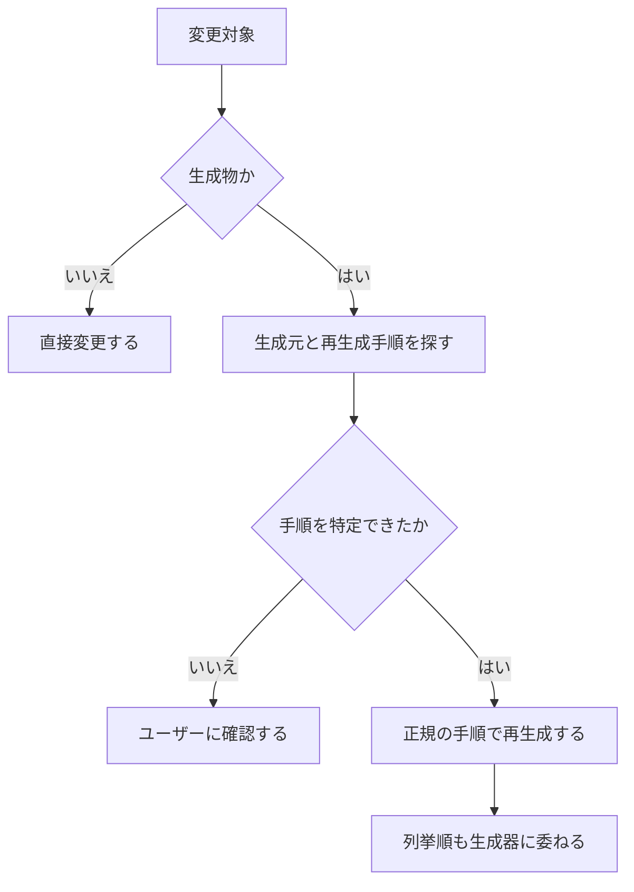

# 運用ガイド

macOS 前提。管理境界は [repo-map.md](repo-map.md) の「管理境界」を正本とする。

## 変更前の確認

変更前は、管理区分を次の順で確定する。


### 生成物

`apm.lock.yaml` などの生成物は手で編集しない。



## 初回セットアップ

```sh
curl -fsSL https://dot.9sako6.com | sh
```

既存ファイルは `~/.dotfiles-backups/` に退避される。
system と home に変更がある場合は、それぞれ表示された plan に対して正確に `yes` と入力する。
`curl | sh` では確認入力だけを制御端末から読み、download 中の script を回答として消費しない。

## 日常コマンド

```sh
git pull                       # 公開dotfilesを通常のGit操作で更新
mise run apply                 # home planを確認して反映
mise run doctor                # 配備、mise、system、Homebrewを診断
mise run plan                  # home planを表示
mise run system:apply          # 選択中のsystem sourceを確認して反映
mise run system:plan           # 選択中のsystem sourceのplanを表示
mise run system:rollback       # 直前のnix-darwin世代へ戻す
mise run test                  # 契約テストを実行
```

他の task は `mise tasks` で一覧できる。

## system source

引数なしでは現在選択中の source を使う。未選択時は公開 dotfiles の local checkout が既定になる。
公開 source は自動で pull しない。private source は、最後に選択した credential を含まない SSH または
HTTPS clone URL の remote default branch を取得し、push 済みの最新 commit を使う。

```sh
mise run system:plan <clone-url>   # 別sourceを試すが選択は変えない
mise run system:apply <clone-url>  # 成功後にsourceを選択する
mise run system:plan --default     # 公開sourceを試す
mise run system:apply --default    # 公開sourceへ戻す
```

`system:plan` は fetch、download、build、cache 更新を行うが、active system、Homebrew、source 選択を
変更しない。Lix がなければ失敗する。`system:apply` は必要なら Lix を導入し、表示した同じ build 済み
世代だけを activation する。plan には system closure の差分と Homebrew cleanup 候補が現れる。
fetch、認証、flake 評価に失敗した場合、古い cache へ fallback しない。

private repository は root に `flake.nix` と commit 済みの `flake.lock` を置き、
`darwinConfigurations.current` を公開する。公開できない差分だけを次のように追加する。

```nix
{
  inputs.dotfiles.url = "github:9sako6/dotfiles?dir=darwin";

  outputs = { self, dotfiles, ... }: {
    darwinConfigurations.current = dotfiles.lib.mkDarwinSystem {
      configurationRevision = self.rev or self.dirtyRev or null;
      primaryUser = "account-name";
      modules = [
        {
          homebrew.casks = [
            "private-app"
          ];
        }
      ];
    };
  };
}
```

公開側は `darwinModules.default` と `lib.mkDarwinSystem` を提供する。public source だけが実行時の
macOS account name を受け取るため、private root flake では `primaryUser` を明示する。
source の選択状態は `/etc/nix-darwin/flake.nix` の symlink だけであり、未知の既存ファイルや symlink は
明示引数があっても置換しない。

## ロールバック

`mise run system:rollback` は remote の取得や flake の評価をせず、保持済みの直前の世代へ戻す。
system source の選択は変えないため、次の `system:plan` は同じ source を診断する。

Nix のガベージコレクションは日本時間で毎週日曜日の 0:00 に実行し、14日を超えた世代を削除する。
削除された世代へはロールバックできない。手動で `nix-collect-garbage` を実行する場合も、
削除対象に必要な世代が含まれないことを確認してから実行する。

## 検証

変更した振る舞いをコマンドやスクリプトで観測してから、`mise run test` を実行する。振る舞いをテストできない場合は、観測可能な境界を作ってから変更する。

設定ファイルやソースの文面を直接検査するテストは書かない。

## 変更前後の基本手順

1. 上の手順で管理区分を確定
2. `home-managed user tools` を変更する場合は、`mise run plan` で配備状況を確認
3. 必要な変更を入れる
4. 「検証」の手順を実施
5. 変更した管理区分に応じて反映
   - `home-managed user tools` — `mise run apply`
   - `system configuration` — `mise run system:apply`
   - `private system configuration` — private repository を push して `mise run system:apply`

`repo runtime` の変更に反映コマンドはない。`system:apply` の初回実行では、
Lix を導入するため途中で `sudo` の認証を求められる。

Homebrew 本体は nix-homebrew、formula と cask は nix-darwin が管理する。

GitHub-hosted macOS runner には管理外の Homebrew が導入済みのため、CI は system derivation の
build までを検証し、activation は行わない。新規 Mac への activation の E2E は、Homebrew のない
VM または実機で確認する。公開インストールの smoke test も user environment の導入と system
derivation の build を分けて検証する。

`apply` は配備したファイルを local state に記録する。後から `home/` のファイルを削除すると、
未変更の配備先は次回の `plan` に退避対象として現れ、`apply` でバックアップへ移る。
配備後に差し替えたり編集したファイルは自動では移動せず、ドリフトとして報告される。
