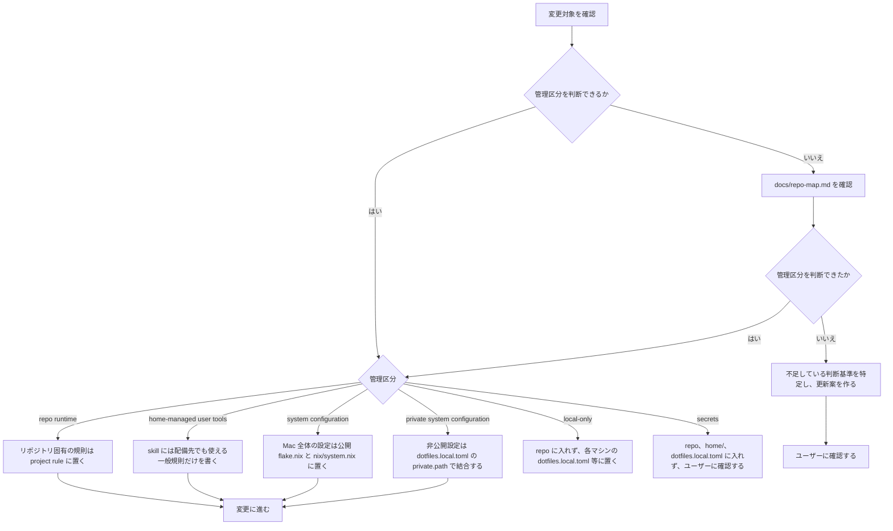
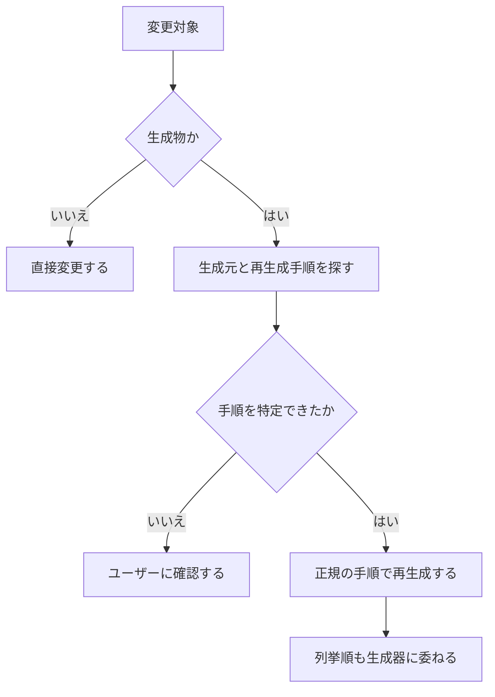

# 運用ガイド

macOS 環境を前提とする。管理境界は [repo-map.md](repo-map.md) の「管理境界」で定義された内容に従う。

## 変更前の確認

変更に着手する前に、管理区分を次の順序で確定する。



### 生成物

`apm.lock.yaml`、`flake.lock`、`nix/localllm/uv.lock` などの生成物は手動で編集しない。
固定ファイルの更新は開発時のみ意図的に行い、`plan` や `apply` の実行中に自動更新されることはない。



## 初回セットアップ

```sh
curl -fsSL https://dot.9sako6.com | sh
```

公開リポジトリ直下の `flake.nix` が唯一の構成ルートである。
Home Manager は nix-darwin のモジュールとして組み込まれているため、システムと通常のホーム設定は同一の `apply` で反映する。
`dotfiles.toml` の `copy` 対象は、システム反映の成功後に Rust CLI が `$HOME` へ実体として配備する。

旧来の配備手順から初めて移行する際、Home Manager が管理する既存ファイルとの競合が発生した場合は、`.pre-home-manager` 接尾辞を付与して退避される。
`curl | sh` の実行時は、確認の入力のみを制御端末から読み取り、ダウンロード中のスクリプトを入力値として消費しない。

## 日常コマンド

```sh
git pull                       # 公開dotfilesを通常のGit操作で更新
dotfiles plan                  # system + homeの差分・配備計画を表示
dotfiles apply                 # planをプレビュー確認後に同一世代を反映
mise run system:rollback       # 直前のnix-darwin世代へ戻す
```

旧 CLI 未適用時または CLI が未導入の場合は、以下のコマンドで直接実行できる。

```sh
DOTFILES_DIR="$PWD" cargo run --locked --manifest-path cli/Cargo.toml -- plan
DOTFILES_DIR="$PWD" cargo run --locked --manifest-path cli/Cargo.toml -- apply
DOTFILES_DIR="$PWD" cargo run --locked --manifest-path cli/Cargo.toml -- settings
```

構成の評価エラーで詳細が省略された場合は、`dotfiles plan --show-trace`でNixのエラーとトレースをその端末に表示する。旧CLIからの移行中は、上記のCargoコマンドの末尾を`-- plan --show-trace`にする。`apply --show-trace`でも指定できるが、原因調査にはシステムを反映しない`plan`を使う。表示には非公開設定が含まれる場合があるため、そのPC内で確認し、公開Issueへそのまま貼り付けない。診断結果のファイル保存やアップロードは行わない。

`dotfiles settings`は、既定値→`dotfiles.toml`→`dotfiles.local.toml`の優先順でマージされた現在の全設定を、`mise settings`と同様にキー・値・設定元の3列で表示します。オプションやキー指定はなく、現在のファイルを対象として`null`や`false`、空配列の値も漏れなく一覧に含めて表示します。なお、既定値が適用されている設定項目の設定元列は空欄として扱われます。

`dotfiles settings`の端末表示では、紫色斜体のKey・Value・Source見出しが表示されます（パイプ出力時は見出しなし）。配列は長さや端末幅、パイプ出力の有無に関わらず、常に要素ごとに改行して出力されます。

システムの日常操作には Rust 製 `dotfiles` CLI を使用する。リポジトリのテストを一括実行するようなサブコマンドは設けない。
その他の補助タスクは `mise tasks` で一覧できる。mise 本体の状態確認には `mise ls --missing` や `mise prune --tools` などの標準コマンドを使用する。

ユーザー単位の常設ツールは Nix 管理を原則とし、新規ツールを mise の `[tools]` に追加しない。既存の mise 管理ツールを更新する際は、Nix へ移行可能かを事前に確認し、合理的に移行できる場合は `nix/packages.nix` と Home Manager へ移す。mise に残すのは Nix で合理的に管理できない例外のみとし、その理由を設定から判別できる状態を維持する。

公開構成の flake ルートはリポジトリ直下の `flake.nix` および `flake.lock` である。Nix で宣言するシステムやホーム設定は `nix/`、共有設定ファイルの実体は `home/` に配置する。

通常の設定ファイルや `.config`、`.zsh.d`、`mybin` は、稼働中のリポジトリへの直接のシンボリックリンクとし、編集内容を即座に反映させる。
一方、devcontainer から参照するエージェント用設定はシンボリックリンクにしない。共有の `dotfiles.toml` に列挙した `.agents/skills`、`.claude/rules`、`.claude/settings.json`、`.claude/skills`、`.codex/AGENTS.md` を `$HOME` へ実体コピーする。

`copy` にディレクトリを指定した場合、その配下全体が dotfiles の管理対象となり、コピー元に存在しない子要素は次回の `apply` で削除される。ただし、指定した親ディレクトリの兄弟要素には触れないため、たとえばホームディレクトリ内の `.claude/skills` を同期しても `.claude` 配下のランタイムファイルは保持される。

## 設定ファイル仕様 (dotfiles.toml / dotfiles.local.toml)

リポジトリには共有設定 `dotfiles.toml` を置き、マシン固有のローカル設定は Git 管理外の `dotfiles.local.toml` で定義する。

- 公開 `flake.nix` が唯一の構成ルートであり、設定ファイルの構文解析は Nix の [builtins.fromTOML](https://nix.dev/manual/nix/2.35/language/builtins.html#builtins-fromTOML) が行い、型検査や設定検証は Nix モジュールのスキーマが担当する。
- CLI は TOML 構文解析エラー時の出力を抑制して設定値の漏洩を防ぐ。スキーマ定義違反、型不一致、未知のキーが存在する場合も評価を停止する。
- テーブル構造は「既定値 < 公開共有 (`dotfiles.toml`) < ローカル (`dotfiles.local.toml`)」の優先順序で再帰的にマージされる。
- 配列およびスカラー値はマージされず、`false` や空配列 `[]` を含めて上位の値で完全に置換される。
- `copy` キーは公開設定 `dotfiles.toml` でのみ指定可能であり、重複、非アルファベット順、絶対パス、`..`、互いに包含関係にあるパスの指定を拒否する。
- `private` セクションはローカル設定 `dotfiles.local.toml` でのみ指定可能である。`private.path` は公開リポジトリルートからの相対パスまたは絶対パス形式の入力を受け付ける（文書内では可搬性のため相対パスで記載する）。
- `dotfiles.local.toml` に認証情報や機密情報を記述してはならない。本ファイルは Git 追跡されないため、必要に応じてユーザーが個別にバックアップする。
- `dotfiles.local.toml` が存在しない場合は、非公開設定の探索を行わずに既定値で評価される。ファイルが存在するにもかかわらず読み取り不能または構文不正である場合は処理を中断する。

### 設定例 1: 非公開リポジトリパスの指定（無効化状態）

```toml
[private]
path = "../private-dotfiles"

[localllm]
enabled = false
```

### 設定例 2: ローカルモデルの有効化

`enabled = true` に設定する場合、`models` にはソートされた一意の既知 ID を指定し、初期ロード対象として 1 モデルを指定する。また、`default_model` は `models` に含まれる ID でなければならない。

```toml
[localllm]
enabled = true
default_model = "qwen3.8-27b-4bit"
models = [
  "qwen3.8-27b-4bit",
]
```

## 反映ライフサイクルとソース管理

`dotfiles plan` および `dotfiles apply` の実行時、CLI は追跡対象の未コミット変更のスナップショットとローカル設定入力を記録する。

- チェックアウト全体をそのまま指す `path:.` による評価は行わず、スナップショットへの強制的なローカルファイル追加も行わない。
- `plan` や `apply` の実行中に、バックグラウンドでの自動 `git clone`、`git pull`、固定ファイルの更新は一切行わない。
- ローカル設定による非純粋性は、明示的かつ一時的なマニフェストとして検証済みの Nix エントリへ渡す箇所のみに局所化され、公開 CI 環境は完全に純粋な評価を保つ。
- `plan` は、システム派生（system derivation）および Homebrew (Brewfile) を構築し、Nix が評価した copy 対象一覧を元に Rust CLI が固定ソースから差分計画を作成してプレビューを表示する。一時的な GC ルートを作成してプレビュー対象の世代が破棄されないよう保持する。稼働中のシステム、Homebrew、シンボリックリンク、ホーム実体ファイルの変更は行わない。
- `apply` は反映の排他ロックを取得し、プレビュー確認後に記録された入力が変更されていないことを検証した上で、同一のビルド済み世代をシステムに反映する。
- 反映結果を記録するシステム側のシンボリックリンクは、選択状態を操作するためのスイッチではなく、成功した反映結果の記録としてのみ更新される。
- 反映順序は、nix-darwin のネイティブ反映（Home Manager を含む） -> 固定された home copy の実体配備 -> 結果記録シンボリックリンクの更新、の順序を厳密に守る。
- 途中で失敗した場合、結果記録シンボリックリンクは以前の正常世代を指したまま保持されるが、システム、ホーム、Homebrew に部分的な変更が残る可能性がある。ロールバックを行う場合は [ロールバック](#ロールバック) の手順に従う。
- 旧 CLI に存在した URL 指定や `--default` フラグによるリモートソース切り替え機能は廃止された。旧構文を実行した場合は、本構成への移行案内が表示される。
- ローカル設定が存在しない状態で旧世代の非公開設定が有効である場合、外部サービスを自動削除するのではなく、安全のため処理を停止する。

## 旧 private root からの移行手順

以前の private root flake 構成から公開単一ルートへの移行は、通常の `plan` の外側で、以下の明示的な手動準備手順に従って実施する。

1. **現状の確認:**
   現在の稼働世代、旧 private root の出力内容、既存の固定ファイル、および未適用の作業変更を記録する。
2. **独立した安定チェックアウトの作成:**
   ローカルに独立した安定した複製または作業領域を作成する。旧来の自動同期キャッシュを作業領域として再利用してはならない。
3. **互換モジュール定義:**
   既存のモジュール資産を活かして private flake 側に `darwinModules.default` バンドルを用意し、公開側や旧 root 側がそのバンドルを利用できるようにする。旧 root 出力と固定ファイルは検証完了まで保持する。
4. **ローカル設定の追加:**
   既存の非公開側の固定ファイルは変更せずコミットされた状態を維持する。公開リポジトリのルートに `dotfiles.local.toml` を作成し、`private.path = "../private-dotfiles"`（非公開リポジトリへの相対パス）および `enabled = false` を設定する。
5. **差分比較と検証:**
   旧 root の状態と公開ベースの差分を、合成された構成結果と比較し、常設サービス、Tap、管理パッケージが意図通り保持されていることを確認する。
6. **反映:**
   確認が完了した段階でのみ `dotfiles apply` を実行する。
7. **公開制限:**
   ユーザーからの明示的な指示がない限り、移行作業に伴うコミットの外部公開を行ってはならない。

## ロールバック

システムを直前の正常な世代に戻す場合は、以下のコマンドを実行する。

```sh
mise run system:rollback
sudo darwin-rebuild switch --rollback
```

ロールバック時の注意点:
- 反映失敗時に途中で停止した場合、結果記録シンボリックリンクは前世代を指しているが、システムや Homebrew に部分的な変更が残されている可能性がある。
- システム世代を戻した後、実体配備したホームファイルを復元するには、過去のコミット済みチェックアウトを明示的に指定して適用する。
- ソース記録シンボリックリンクの差し戻しや整合性の確認は、システムとホームの復元が検証された後にのみ行う。
- 過去世代の固定ファイルおよびビルドキャッシュは破棄せず保持しなければならない。

Nix のガベージコレクションは日本時間で毎日 0:00 に実行され、2日を超えた古い世代を削除する。
手動で `nix-collect-garbage` を実行する場合も、ロールバックに必要な世代が含まれていないことを事前に確認する。

## ローカル LLM と OpenCode (localllm)

共有の `dotfiles.toml` では `enabled = false` を維持し、ローカルLLMを利用するホストのみGit管理外の `dotfiles.local.toml` で `enabled = true` に上書きします。無効時（`false`）の通常の `plan` / `apply` ではQwenモデル、MLX実行環境、専用OpenCodeが依存関係に含まれないため、これらが取得されることはありません（他ツールと共有される汎用Python等は除きます）。なお、開発・検証目的で `nix build .#localllm` を明示的にビルドした場合や、過去に有効化して取得されたストアパスは設定を無効化するだけでは削除されず、Nixのガベージコレクション（GC）を実行するまでローカルに残ります。

Apple Silicon向けにQwen 3.8-27B（4-bit）のNix導入構成を用意し、合成非機密入力によるMetal推論およびOpenCodeのwrite/readツール操作まで検証済みですが、あらゆる利用環境での動作を保証するものではありません。 推論バックエンドは [uv2nix](https://pyproject-nix.github.io/uv2nix/usage/getting-started.html) および `nix/localllm/uv.lock` で固定された `mlx-vlm 0.7.0` および Metal 向け wheel `mlx 0.32.2` を使用する。実行時の動的な追加パッケージ取得は行わない。すべてのパッケージ実装は `nix/packages.nix` が所有する。

サーバーはメモリを抑えるためKVキャッシュ4bit、prefill 64トークン、同時リクエスト1件とし、システムのGPUメモリ上限や常駐アプリの状態は変更しません。そのため、長い入力では応答までに数分かかることがあります。

- **実行コマンド:**
  - `localllm chat -- <opencode-arguments>` (プロンプト実行引数を渡す)
  - `localllm serve` (推論サーバーの単独起動)
  - `localllm check` (Metal 演算のみを確認)
- **実行特性:**
  - 常駐デーモンは存在せず、オンデマンドで単一の所有プロセスツリーとして起動する。
  - 外部ネットワークからの接続を受け付けないローカル接続用のアドレスにバインドする。
  - 初回ビルド時または初回取得時には、約 16 GB のモデルデータ取得が行われる旨が事前に通知される。
- **リソースの回収:**
  - `localllm` を無効化（`enabled = false`）した構成一式には、LLM 固有の依存関係は一切含まれない。
  - 使用されなくなったモデルデータは後続の Nix ガベージコレクションによって削除されるが、他の構成と共有されている基本依存関係は維持される。
- **OpenCode 統合とセキュリティ制限:**
  - OpenCode 1.18.13 を使用し、設定仕様は [OpenCode 設定ドキュメント](https://opencode.ai/docs/config/) に準拠する。
  - 独立した専用の XDG 設定ディレクトリおよび履歴領域を使用し、外部スキル、プラグイン、MCP サーバー、およびセッション共有機能は無効化される。
  - メインモデルおよび小型モデルの双方がローカルエンドポイントを利用するよう構成され、実行前にマージ結果が検証される。
  - 推論サーバー側には外向き通信を一切許さず、クライアントは起動したサーバーのポートへの通信のみを許可する。macOS の `sandbox-exec` によるネットワーク制限を適用する（包括的なデータ安全性を保証するものではない）。
  - 自動テストでは、サーバー未起動時の適切なエラー処理およびネットワーク遮断が正しく機能することを検証する。
  - 実機 GPU を用いた推論や大容量モデルの取得テストは CI から分離されており、CI 上でシステム反映を実行したり巨大モデルを取得してはならない。

## 検証

変更した振る舞いはコマンドやスクリプトを用いて観測する。リポジトリ全体を検証する際はラッパーを挟まず、CI と同一のテストコマンドを直接実行する。

```sh
bun install --frozen-lockfile
bun run tsc --noEmit
bun test ./tests ./home/.apm/skills/anki/tools/*.test.ts
cargo fmt --check --manifest-path cli/Cargo.toml
cargo clippy --locked --manifest-path cli/Cargo.toml --all-targets -- -D warnings
cargo test --locked --manifest-path cli/Cargo.toml
nix build --no-link .#checks.aarch64-darwin.composition .#checks.aarch64-darwin.configuration .#checks.aarch64-darwin.modelFetch
opencode_package="$(nix build --no-link --print-out-paths .#localllmClient)"
DOTFILES_TEST_OPENCODE="$opencode_package/bin/opencode" python3 -m unittest discover -s nix/localllm -p 'test_*.py'
python3 -m unittest discover -s nix/tests -p 'test_*.py'
nix build --no-link --offline .#checks.aarch64-darwin.modelFetch
```

- `nix build` によるテストでは、固定ハッシュを持つ小さなテスト用データを用いてモデル取得ロジックを検証し、反復ビルド時のキャッシュ動作を確認する。
- 純粋なシステム評価テストとして `nix eval --raw .#darwinConfigurations.current.system.drvPath` を実行し、テスト用ユーザー設定を用いてローカルの非純粋性を排除した評価が通ることを検証する。
- 依存固定ファイルの更新は開発時のみ明示的に行い、以下のコマンドを使用する。
  - `uv lock --project nix/localllm`
  - `nix flake lock`

設定ファイルやソースコードの文面そのものを直接検査するテストは作成しない。

## 変更前後の基本手順

1. 上の手順で管理区分を確定
2. `home-managed user tools` や構成を変更する場合は、`dotfiles plan` で Home Manager、パッケージ差分、および copy 対象を確認
3. 必要な変更を入れる
4. 「検証」の手順を実施
5. 変更した管理区分に応じて反映
   - `home-managed user tools` — `dotfiles apply`
   - `system configuration` — `dotfiles apply`
   - `private system configuration` — `dotfiles.local.toml` を更新し `dotfiles apply`

`repo runtime` の変更に対する反映コマンドはない。

Homebrew 本体は nix-homebrew、formula と cask は nix-darwin、通常のホームディレクトリ設定は Home Manager、devcontainer から参照可能な copy 対象は Rust CLI がそれぞれ管理する。

GitHub-hosted な macOS runner では、Home Manager のユーザー反映とシステム派生のビルドを個別に検証し、nix-darwin のシステム反映は実施しない。Nix ストアのパスは GitHub Actions のバイナリキャッシュを活用してワークフロー間で再利用する。新規 Mac への反映検証は、Homebrew の入っていない VM または実機で確認する。
