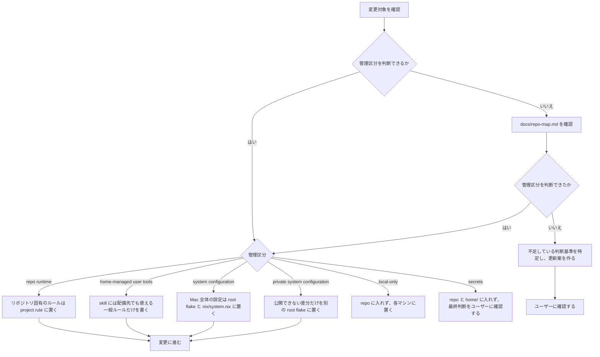
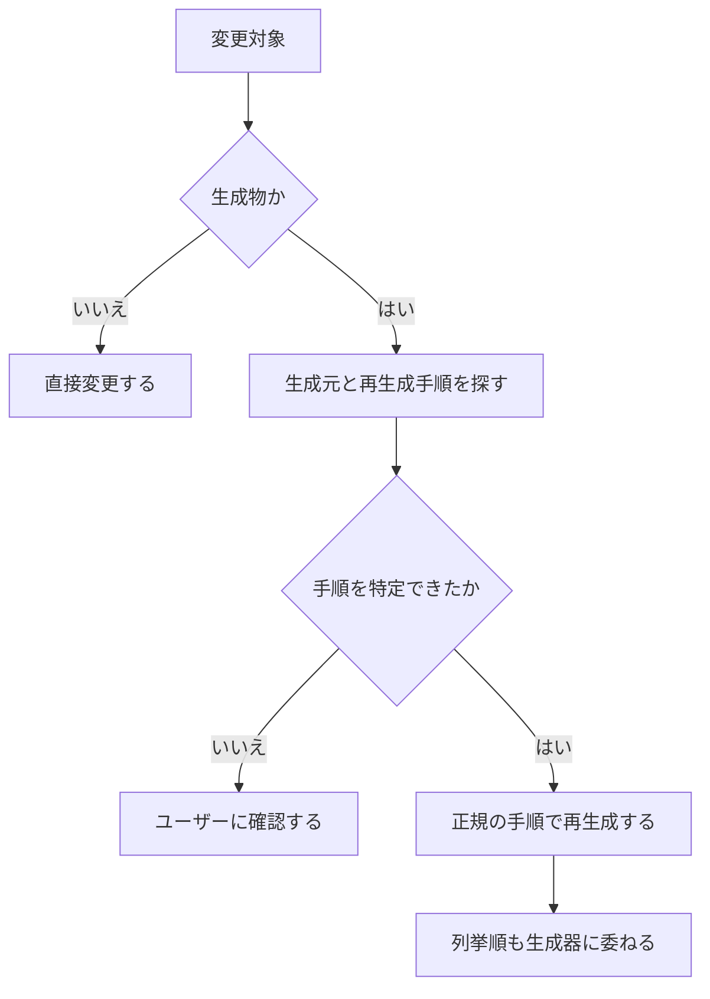

# 運用ガイド

macOS 環境を前提とする。管理境界は [repo-map.md](repo-map.md) の「管理境界」で定義された内容に従う。

## 変更前の確認

変更に着手する前に、管理区分を次の順序で確定する。



### 生成物

`apm.lock.yaml` などの生成物は手動で編集しない。



## 初回セットアップ

```sh
curl -fsSL https://dot.9sako6.com | sh
```

Home Manager は nix-darwin のモジュールとして組み込まれているため、system と通常の home 設定は同一の `apply` で反映する。
`dotfiles.toml` の `copy` 対象は、system activation の成功後に Rust CLI が `$HOME` へ実体として配備する。

旧 home deployer から初めて移行する際、Home Manager が管理する既存ファイルとの競合が発生した場合は、`.pre-home-manager` 接尾辞を付与して退避される。
`curl | sh` の実行時は、確認の入力のみを制御端末から読み取り、ダウンロード中のスクリプトを入力値として消費しない。

## 日常コマンド

```sh
git pull                       # 公開dotfilesを通常のGit操作で更新
dotfiles apply                 # system + homeを確認して反映
dotfiles plan                  # system + homeのplanを表示
mise run system:rollback       # 直前のnix-darwin世代へ戻す
```

旧CLIは旧名の設定ファイルを参照するため、そのままでは設定を正しく読み込めません。新CLIが導入されるまでは、リポジトリ直下でcargo経由で実行する必要があります。

```sh
DOTFILES_DIR="$PWD" cargo run --locked --manifest-path cli/Cargo.toml -- apply
```

system の日常操作では、`plan` および `apply` に Rust 製 `dotfiles` CLI を使う。リポジトリのテストを一括実行するような `dotfiles` サブコマンドは設けない。
その他のタスクは `mise tasks` で一覧できる。mise 本体の状態確認には `mise ls --missing` や `mise prune --tools` などの標準コマンドを使用する。

ユーザー単位の常設ツールは Nix 管理を原則とし、新規ツールを mise の `[tools]` に追加しない。既存の mise 管理ツールを更新する際は、Nix へ移行可能かを事前に確認し、合理的に移行できる場合は `nix/packages.nix` と Home Manager へ移す。mise に残すのは Nix で合理的に管理できない例外のみとし、その理由を設定から判別できる状態を維持する。

公開構成の flake root はリポジトリ直下の `flake.nix` および `flake.lock` である。Nix で宣言する system / home 設定は `nix/`、共有設定ファイルの実体は `home/` に配置する。

通常の設定ファイルや `.config`、`.zsh.d`、`mybin` は、稼働中の dotfiles チェックアウトへの out-of-store link とし、編集内容を即座に反映させる。
一方、devcontainer から参照する agent resources は symlink にしない。リポジトリルートの `dotfiles.toml` に列挙した `.agents/skills`、`.claude/rules`、`.claude/settings.json`、`.claude/skills`、`.codex/AGENTS.md` を `$HOME` へ実体コピーする。これにより、コンテナ側からホスト側の `/nix/store` やホームディレクトリの絶対パスを解決する必要をなくしている。

`copy` にディレクトリを指定した場合、その配下全体が dotfiles の管理対象となり、source に存在しない子要素は次回の `apply` で削除される。ただし、指定した親ディレクトリの兄弟要素には触れないため、たとえばホームディレクトリ内の `.claude/skills` を同期しても `.claude` 配下のランタイムファイルは保持される。
`dotfiles.toml` は未知のキー、重複、非アルファベット順、絶対パス、`..`、互いに包含関係にあるパスの指定を拒否する。`plan` は定義と source の存在を検証して配備先を表示するのみで、copy は行わない。`apply` は system activation が成功した場合にのみ copy を実行する。

public system は、`plan` / `apply` を実行しているチェックアウトを自動で使用する。private な root flake が、既定であるホームディレクトリ直下の `dotfiles` 以外を参照する場合は、`lib.mkDarwinSystem` の `dotfilesDirectory` 引数で明示する。

## system source

引数を指定しない場合は、現在選択中の source を使用する。未選択時の既定値は公開 dotfiles のローカルチェックアウトとなる。
公開 source は自動で pull されない。private source では、最後に選択した clone URL（認証情報を含まない SSH または HTTPS）からリモートの default branch を取得し、push 済みの最新コミットを使用する。

```sh
dotfiles plan <clone-url>   # 別sourceを試すが選択は変えない
dotfiles apply <clone-url>  # 成功後にsourceを選択する
dotfiles plan --default     # 公開sourceを試す
dotfiles apply --default    # 公開sourceへ戻す
```

`plan` は fetch、ダウンロード、ビルド、キャッシュ更新を行うが、稼働中の system、Homebrew、source 選択、home copy は変更しない。なお、Lix が未導入の環境では処理が失敗する。
`apply` は必要に応じて Lix を導入し、表示した同一のビルド済み世代のみをアクティベーションする。Home Manager のアクティベーションもこの system activation に含まれ、成功後に home copy が反映される。
plan の出力には、system closure の差分、Homebrew の未導入依存関係、クリーンアップ候補、および home copy 対象が表示される。

fetch、認証、または flake の評価に失敗した場合、古いキャッシュへフォールバックすることはない。
`apply` はアクティベーションと source 選択を 1 回の `sudo` 実行で完了させ、長時間の処理後に再認証を要求しない。また、同一の source 選択を使用する `apply` がすでに実行中の場合は、後から開始された処理を拒否する。

private リポジトリを構成する場合は、`nix/flake.nix.template` をルートの `flake.nix` としてコピーし、`primaryUser` を実際の macOS アカウント名に置き換える。公開できない差分のみを `modules` に追加し、`nix flake lock` で生成した `flake.lock` と合わせてコミットする。

```nix
modules = [
  {
    homebrew.casks = [
      "private-app"
    ];
  }
];
```

公開側リポジトリは `darwinModules.default` と `lib.mkDarwinSystem` を提供する。実行時の macOS アカウント名と稼働中の dotfiles チェックアウトを受け取るのは public source のみであるため、private root flake では `primaryUser` を明示的に指定する必要がある。

source の選択状態は `/etc/nix-darwin/flake.nix` の symlink のみで保持され、未知の既存ファイルや symlink が存在する場合は明示的な引数があっても上書きしない。旧公開 source の `darwin/flake.nix` を指す選択状態は、次回の `apply` 成功時にルートの `flake.nix` へと自動で移行される。

## ロールバック

`mise run system:rollback` は、リモートの取得や flake の評価を行わず、保持されている直前の世代へシステムを戻す。
system source の選択状態は変更しないため、次回の `plan` も同じ source を対象に診断する。

Nix のガベージコレクションは日本時間で毎日 0:00 に実行され、2日を超えた古い世代を削除する。
削除された世代へはロールバックできないため、手動で `nix-collect-garbage` を実行する場合も、削除対象に必要な世代が含まれていないことを事前に確認する。

## 検証

変更した振る舞いはコマンドやスクリプトを用いて観測する。リポジトリ全体を検証する際はラッパーを挟まず、CI と同一のテストコマンドを直接実行する。

```sh
bun install --frozen-lockfile
bun run tsc --noEmit
bun test ./tests ./home/.apm/skills/anki/tools/*.test.ts
cargo fmt --check --manifest-path cli/Cargo.toml
cargo clippy --locked --manifest-path cli/Cargo.toml --all-targets -- -D warnings
cargo test --locked --manifest-path cli/Cargo.toml
```

設定ファイルやソースコードの文面そのものを直接検査するテストは作成しない。

## 変更前後の基本手順

1. 上の手順で管理区分を確定
2. `home-managed user tools` を変更する場合は、`dotfiles plan` で Home Manager と copy 対象を確認
3. 必要な変更を入れる
4. 「検証」の手順を実施
5. 変更した管理区分に応じて反映
   - `home-managed user tools` — `dotfiles apply`
   - `system configuration` — `dotfiles apply`
   - `private system configuration` — private repository を push して `dotfiles apply`

`repo runtime` の変更に対する反映コマンドはない。また、`apply` の初回実行時は Lix を導入するため、処理の途中で `sudo` による認証を求められる。

Homebrew 本体は nix-homebrew、formula と cask は nix-darwin、通常のホームディレクトリ設定は Home Manager、devcontainer から参照可能な copy 対象は Rust CLI がそれぞれ管理する。

GitHub-hosted な macOS runner では、Home Manager の user activation と system derivation のビルドを個別に検証し、nix-darwin の system activation は実施しない。Nix store のパスは GitHub Actions のバイナリキャッシュを活用してワークフロー間で再利用する。新規 Mac への activation E2E は、Homebrew の入っていない VM または実機で確認する。
