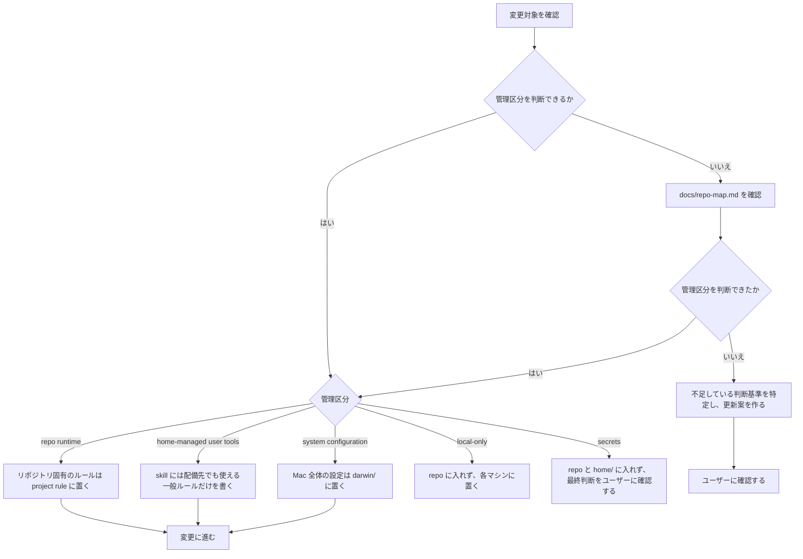
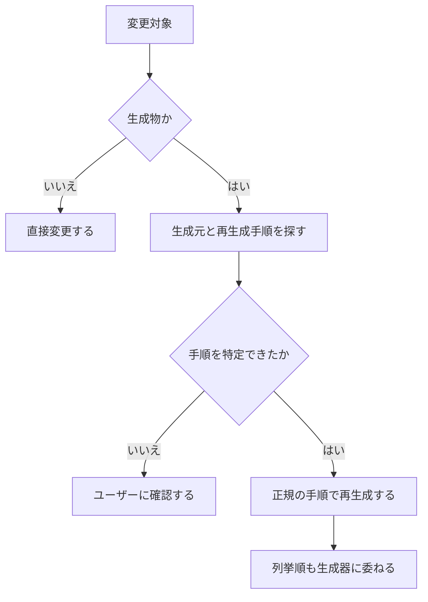

# 運用ガイド

macOS 前提。管理境界は [repo-map.md](repo-map.md) の「管理境界」を正本とする。

## 変更前の確認

変更前は、管理区分を次の順で確定する。



### 生成物

`apm.lock.yaml` などの生成物は手で編集しない。



## 初回セットアップ

```sh
curl -fsSL https://dot.9sako6.com | sh
```

既存ファイルは `~/.dotfiles-backups/` に退避される。

## 日常コマンド

```sh
dot pull            # origin/master の変更を fast-forward で取得
dot plan            # 配備計画を表示（filesystem は変更しない）
dot apply           # 計画を確認して home/ を home directory に反映
dot doctor          # 配備、mise、Homebrewのドリフトを診断
mise run install:system # Lix と nix-darwin で macOS の設定を反映
mise run test       # 契約テストを実行
```

他の task は `mise tasks` で一覧できる。

## 変更前後の基本手順

1. 上の手順で管理区分を確定
2. `home-managed user tools` を変更する場合は、`dot plan` で配備状況を確認
3. 必要な変更を入れる
4. `mise run test` で回帰を確認
5. 変更した管理区分に応じて反映
   - `home-managed user tools` — `dot apply`
   - `system configuration` — `mise run install:system`

`repo runtime` の変更に反映コマンドはない。`install:system` の初回実行では、
Lix を導入するため途中で `sudo` の認証を求められる。

Homebrew 本体は nix-homebrew、formula と cask は nix-darwin が管理する。
既存 Homebrew の移行中は `autoMigrate = true`、`mutableTaps = true` にし、
`install:system` の初回成功後は両方を `false` へ戻す。

GitHub-hosted macOS runner には管理外の Homebrew が導入済みのため、CI は system derivation の
build までを検証し、activation は行わない。新規 Mac への activation の E2E は、Homebrew のない
VM または実機で確認する。公開インストールの smoke test も user environment の導入と system
derivation の build を分けて検証する。

`apply` は配備したファイルを local state に記録する。後から `home/` のファイルを削除すると、
未変更の配備先は次回の `plan` に退避対象として現れ、`apply` でバックアップへ移る。
配備後に差し替えたり編集したファイルは自動では移動せず、ドリフトとして報告される。
