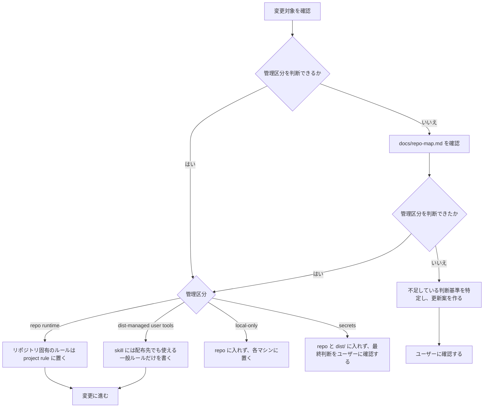
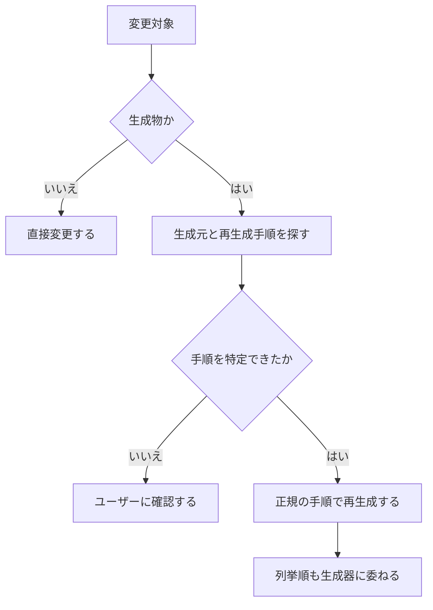

# 運用ガイド

macOS 前提。管理境界は [repo-map.md](repo-map.md) の「管理境界」を正本とする。

## 変更前の確認

変更前は、管理区分を次の順で確定する。



### 生成物

`apm.lock.yaml` などの生成物は手で編集しない。



## 初回セットアップ

```sh
curl -fsSL dot.9sako6.com | bash
```

既存ファイルは `~/.dotfiles-backups/` に退避される。

## 日常コマンド

```sh
mise run plan       # 配備計画を表示（filesystem は変更しない）
mise run apply      # dist/ を home directory に反映
mise run dev:test   # 契約テストを実行
```

他の task は `mise tasks` で一覧できる。

## 変更前後の基本手順

1. `mise run plan` で確認
2. 必要な変更を入れる
3. `mise run dev:test` で回帰を確認
4. `mise run apply` で反映
