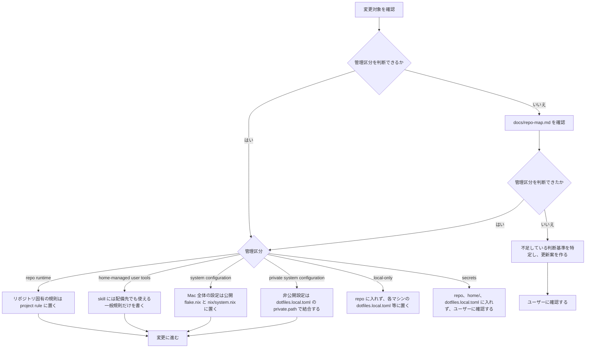
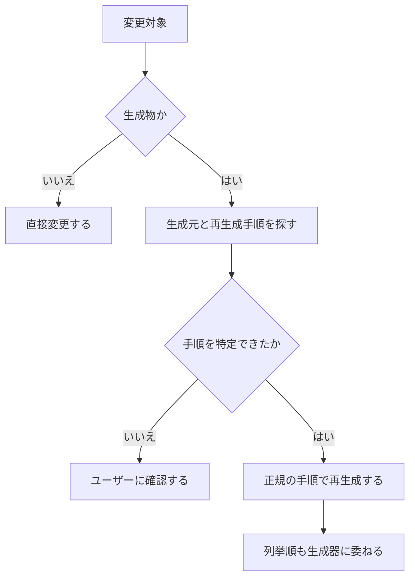

# 運用ガイド

macOS 環境を前提とする。管理境界は [repo-map.md](repo-map.md) の「管理境界」で定義された内容に従う。

## 変更前の確認

変更に着手する前に、管理区分を次の順序で確定する。


```mermaid
flowchart TD
    start["変更対象を確認"] --> known{"管理区分を判断できるか"}
    known -->|"はい"| boundary{"管理区分"}
    known -->|"いいえ"| map["docs/repo-map.md を確認"]
    map --> resolved{"管理区分を判断できたか"}
    resolved -->|"はい"| boundary
    resolved -->|"いいえ"| proposal["不足している判断基準を特定し、更新案を作る"]
    proposal --> ask["ユーザーに確認する"]
    boundary -->|"repo runtime"| repo["リポジトリ固有の規則は project rule に置く"]
    boundary -->|"home-managed user tools"| home["skill には配備先でも使える一般規則だけを書く"]
    boundary -->|"system configuration"| system["Mac 全体の設定は公開 flake.nix と nix/system.nix に置く"]
    boundary -->|"private system configuration"| private["非公開設定は dotfiles.local.toml の private.path で結合する"]
    boundary -->|"local-only"| local["repo に入れず、各マシンの dotfiles.local.toml 等に置く"]
    boundary -->|"secrets"| secrets["repo、home/、dotfiles.local.toml に入れず、ユーザーに確認する"]
    repo --> change["変更に進む"]
    home --> change
    system --> change
    private --> change
```

### 生成物

`apm.lock.yaml`、`flake.lock`、`nix/localllm/uv.lock` などの生成物は手動で編集しない。
固定ファイルの更新は開発時のみ意図的に行い、`plan` や `apply` の実行中に自動更新されることはない。

flake.lock は上流の inputs やリビジョンを固定するものであり、選択された cask の一覧を記録するものではないため、既存パッケージの選択・解除のみで更新する必要はありません。

| トリガー | コマンド |
| --- | --- |
| flake inputs の追加・変更 | `nix flake lock` ([公式ドキュメント](https://docs.lix.systems/manual/lix/nightly/command-ref/new-cli/nix3-flake-lock.html)) |
| nixpkgs など固定された input の意図的な更新 | `nix flake update nixpkgs` ([公式ドキュメント](https://docs.lix.systems/manual/lix/nightly/command-ref/new-cli/nix3-flake-update.html)) |
| スキル依存の追加・削除・更新 | 対応する `dotfiles agents install`、`uninstall`、`update` および生成される `home/apm.lock.yaml` |


```mermaid
flowchart TD
    target["変更対象"] --> generated{"生成物か"}
    generated -->|"いいえ"| edit["直接変更する"]
    generated -->|"はい"| locate["生成元と再生成手順を探す"]
    locate --> found{"手順を特定できたか"}
    found -->|"いいえ"| ask["ユーザーに確認する"]
    found -->|"はい"| regenerate["正規の手順で再生成する"]
    regenerate --> order["列挙順も生成器に委ねる"]
```

## 初回セットアップ

```sh
curl -fsSL https://dot.9sako6.com | sh
```

`install.sh` はorigin/masterへ安全に収束したcheckoutでmiseと固定Rustを用意し、mise経由でCLIを起動する。CLIは `~/.local/bin/dotfiles` へatomicに更新してから通常のapplyを行う。初回system構成にはLixが必要だが、CLIのビルドにNixのCI toolsetは使わない。applyは固定global mise lockでtoolsを導入するため、最後に別の未固定installを重ねない。

既存のdirty checkout、別branch、origin/masterにないcommitは自動更新しない。途中失敗後は原因を解消して同じbootstrapを再実行する。Home Managerがbackupを必要とするprivate構成では従来の `.pre-home-manager` を使う。

## 日常コマンド

Piの導入は見送り、APMの管理対象は`home/apm.yml`の`targets`のみとします。現行のAPM 0.26.0のまま更新は不要で、`compilation.output`を`.codex/AGENTS.md`、`strategy`を`single-file`と指定してリポジトリの`home/`配下に生成します。ホームへの実体配備は`dotfiles.toml`の`copy`配列に列挙した相対パスのみで行い、生成物の再配置やツール別の個別コピーはありません。OpenCodeは`opencode.json`の`instructions`設定でCodexと同じ生成ファイルを参照します。

システムの確認・反映、設定の一覧、エージェント管理のコマンドは[CLIのUsage](../cli/README.md#usage)を参照してください。個別の説明は[settings](../cli/README.md#settings)と[agents](../cli/README.md#agents)にあります。

`dotfiles settings` は現在のpublic宣言と、最後に反映したsystem/privateの記録を分けて表示する。toolsはmise、homeはsymlink/copy、public user servicesはlaunchdと表示する。active generationがなければsystem記録は未取得と表示し、Nix評価で補わない。settingsはmise、launchctl、Nixを起動せず、配置や状態を書き換えない。

`dotfiles plan` / `dotfiles apply` は同じsnapshotとPlannerを使う。差分があれば一度だけ表示し、applyはyesを一度確認する。no-opは確認せず終了する。public home、tools、artifact、Night Shift、user servicesを反映してから、必要な場合だけsystemをbuildする。build完了後に入力を再検証し、最後のactivation直前だけsudoを使う。system generation内のdotfilesには依存しない。

CLIだけを更新した場合はmiseの固定Rustでrootlessにbuildし、新binaryへre-execしてからPlanを作る。system identityが同じなら、CLI/home/tools/serviceだけの変更でNixやsudoを起動しない。移行初回は新形式のidentityを持つsystem generationが必要なため、通常のsystem applyが一度発生する。

artifactの評価結果やGC rootを失った場合は、固定入力からrootless Nixで再構築する。これはsystem activationの理由にはしない。private moduleの既存interfaceを保つため、private選択時はマージ済み設定全体の変更をsystem-affectingとして扱う。

実行中は各工程の開始・終了と、長い工程では10秒ごとの経過時間をstderrに表示する。確認後にsource、private lock、active generationなどが変わった場合は停止する。rootless反映が済んだ後にbuildやactivationが失敗した場合も、済んだ結果は保持し、再applyで続ける。

公開リポジトリの更新には通常のGit操作を使います。

```sh
git pull
```

その他の補助タスクは `mise tasks` で一覧できる。mise 本体の状態確認には `mise ls --missing` や `mise prune --tools` などの標準コマンドを使用する。

普通のCLIは[パッケージと環境の原則](repo-map.md#パッケージと環境の原則)に従い、miseで管理する。普通のCLIはmiseの `[tools]` にバージョンを宣言し、通常のインストールは `mise install --locked` で行い、commit済みのglobal lockを使う。`dotfiles apply` は確認済みの tools Plan を `mise install --locked` で反映し、設定と lock の不変および導入後の収束を検証する。初回bootstrapでは既存の `install.sh` がmiseインストールを行う。

`home/.config/mise/mise.lock` はDarwin arm64向けの固定入力で、通常反映では書き換えない。バージョン更新は開発操作として `mise upgrade --bump <tool>` を行い、macOSで `mise lock --global --platform macos-arm64` を実行して設定とlockを一緒にcommitする。npmやRustなどartifact URLを記録しないbackendはmise標準のversion固定に従う。

Gitの通常シェル向け配備はmiseの `conda:git` で固定する。初回cloneにはmise導入前から利用できるmacOSのGitが必要で、CLIの入力snapshotはPATH上のGitを使う。CIとNixでのCLIビルドには既存のNix Gitを残し、miseの配備と混ぜない。

AWS CLI は特定の環境との相性による起動遅延を避けるため、mise の `[tools]` にバージョンを宣言する。`disable_tools = ["awscli"]` はこの定義を無視するため、通常の mise インストールと PATH への追加は行われない。実行時には別途インストールした AWS CLI が PATH 上に必要であり、Nix 版の削除を反映する前にその存在を確認する。

公開構成の flake ルートはリポジトリ直下の `flake.nix` および `flake.lock` である。Nix で宣言するシステムやホーム設定は `nix/`、共有設定ファイルの実体は `home/` に配置する。

通常の設定ファイルや `.config`、`.zsh.d`、`mybin` の各ファイルは、Rust CLI が稼働中のリポジトリへの直接のシンボリックリンクとして配備する。ディレクトリ自体をリンクにせず、管理外の兄弟ファイルを保持する。編集内容は即座に反映され、配備対象の追加・削除は次の apply で反映する。copy と重なる対象は copy を優先する。旧 Home Manager リンクは有効な宣言と参照先を確認できた場合だけ移行し、private の配備対象との重複は拒否する。
devcontainerから参照するエージェント用設定の実体配備は、CLIの[copy](../cli/README.md#copy)を参照してください。対象パスの制約、ディレクトリ配下の同期範囲、Home Managerとの重複検査、権限の扱いを説明しています。

public copy と live symlink の成功結果は `$XDG_STATE_HOME/dotfiles/home.json`（未指定時は `$HOME/.local/state/dotfiles/home.json`）へリソース単位で記録する。宣言から外れた対象は、前回成功時の内容・種別・権限と一致する場合だけ削除し、利用者が変更したものやHome Managerが置き換えたリンクは残す。途中失敗しても完了した対象の記録は残り、再applyで続けられる。記録がなくなった場合は現在の宣言から成功結果を再構築し、過去の所有範囲を推測して削除しない。記録が壊れている場合や対応しない形式の場合は、copyや削除をせずに停止する。

## Zinitプラグインの検証

プラグイン読み込みには`dotfiles zinit verify`による検証が必要です。新CLI未導入時は検証不能として読み込みが拒否されるため、通常のapplyでCLIを更新してください。本コマンドはNixやdotfilesのチェックアウトを要求せず、外部コマンドはGitだけを使います。

検証処理はRustのtomlクレートでmiseの`config.toml`を直接解析します。配備先のGit HEADが設定の40桁コミットと一致し、dirtyでないプラグインのみを正常と判定します。設定の構文エラーなど全体エラー時はstdoutへ出力されません。

問題のあるプラグインはstderrへ診断を出力して拒否し、1件でも拒否があれば終了コード1を返します。その際も正常なプラグインはstdoutへ出力されるため、zshrcは1回の呼び出しで得られた検証済みプラグインのみを読み込みます。

## CLI のビルドキャッシュ

`.github/workflows/cache-cli.yml` は、`master` への push または手動実行時に macOS arm64 上で Lix をセットアップし、`.#dotfiles` をビルド（Rustの回帰テストを含む）します。CLIのversionと`.#dotfiles.version`の一致を検証後、公開 CLI と実行時依存のみを [Cachix](https://docs.cachix.org/getting-started) へ [push](https://docs.cachix.org/pushing) します。Cachix 1.11.1 は root flake の `.#cachix` から取得し、`nix build` や `run` では `--no-update-lock-file` および `--no-write-lock-file` で固定ファイル更新を禁止しています。なお、本ワークフローのアップロード対象に private 構成を含むシステム世代や LLM モデルは含めません。

### 必要な設定

1. Cachix で公開 cache を作成します。
2. cache 限定書き込み token を GitHub Actions secret の `CACHIX_AUTH_TOKEN`、cache 名を Actions variable の `CACHIX_CACHE_NAME` に登録します（token を公開ファイルへ書かないでください）。
3. 利用者固有のCachix cache URLと公開鍵は、`dotfiles.local.toml` の `private.path` で結合する非公開側 `darwinModules.default` 内の `nix.settings.substituters` および `nix.settings.trusted-public-keys` に追加してください。その際、既定のNix公式キャッシュは保持したまま追記し、設定完了後に `dotfiles apply` を実行して変更を反映します。

CLIのNix derivationバージョンはcli/の内容ハッシュに基づくsource-...として定義し、システムのconfigurationRevisionと独立して管理します。CIではこのバージョンが.#dotfiles.versionと一致することを検証します。直接cargo buildを実行した場合は、cli/に最後に触れたコミットと未コミット変更の有無（dirty）を表示します。CLIキャッシュは、cli/のソースに加えflake.lock由来のtoolchain等ビルド入力が同一である場合に再利用します。cli/以外のコミット進行のみによる再コンパイルを抑止します。

完成済み出力がローカルNix storeにあれば出力を直接指定して一時GCルートで保持し、依存ビルド計画の再走査を避ける。未取得または保持に失敗する場合は同じ固定derivationから従来どおりキャッシュ取得やビルドを行い、入力やアクティブ世代の検証は省略しない。

個別のシステム世代はこのリポジトリのCIで公開しないため、最上位世代のallowSubstitutesをfalseに設定して外部キャッシュへの問い合わせを省略しています。CLI本体や依存パッケージのバイナリキャッシュ取得は維持されます。

公開・非公開・ローカル設定の入力が同一であればローカルのNix評価キャッシュを再利用し、入力変更時やキャッシュ削除時には再評価を行います。評価キャッシュの外部アップロードはなく、Cachixは公開CLI成果物の配信にのみ利用されます。copy計画の策定とapply直前の入力検証は毎回実施します。Homebrewの確認・反映は通常のシステム反映経路で行います。

## 設定ファイル仕様 (dotfiles.toml / dotfiles.local.toml)

設定項目、既定値、マージ規則、設定例はCLIの[設定ファイル](../cli/README.md#設定ファイル)を参照してください。

## 反映ライフサイクルとソース管理

入力の扱いはCLIの[実行対象の選択](../cli/README.md#実行対象の選択)、反映順序と整合性の設計は[設計文書](repo-map.md#cli-と評価反映の整合性)を参照してください。失敗時は[ロールバック](#ロールバック)の手順で復旧します。

## ロールバック

システムを直前の正常な世代に戻す場合は、以下のコマンドを実行する。

```sh
mise run system:rollback
sudo darwin-rebuild switch --rollback
```

ロールバック時の注意点:
- 反映失敗時に途中で停止した場合、結果記録シンボリックリンクは前世代を指しているが、システムや Homebrew に部分的な変更が残されている可能性がある。
- システム世代を戻した後、実体配備したホームファイルを復元するには、過去のコミット済みチェックアウトを明示的に指定して適用する。
- ソース記録シンボリックリンクの差し戻しや整合性の確認は、システムとホームの復元が検証された後にのみ行う。
- 過去世代の固定ファイルおよびビルドキャッシュは破棄せず保持しなければならない。

Nix のガベージコレクションは日本時間で毎日 0:00 に実行され、2日を超えた古い世代を削除する。
手動で `nix-collect-garbage` を実行する場合も、ロールバックに必要な世代が含まれていないことを事前に確認する。

## ローカル LLM と OpenCode (localllm)

macOS 27環境においてNix版OpenCode 1.18.13がコード署名不正によりSIGKILLで終了する事象に対応するため、設定検査の失敗時に終了コードおよびシグナル名を表示するよう改修するとともに、Darwin用ビルドで実行前に再署名を行い署名後のstripを停止する修正（[nixpkgs PR #550458](https://github.com/NixOS/nixpkgs/pull/550458)）をバックポート適用しました。

ローカルLLMの有効化とモデル指定はCLIの[localllm設定](../cli/README.md#localllm)を参照してください。設定が無効でも、開発・検証目的で`nix build .#localllm`を明示的に実行するとパッケージをビルドします。以前に取得したモデルデータは無効化だけでは削除されず、不要になったストアパスは後続のNixガベージコレクションで回収されます。

新しく導入されるモデルID `qwen3.8-9b-distill-4bit` は、Qwen3.5-9BをベースとしたEmperoの `Qwen3.8-9B-Distill` について、[配布元](https://huggingface.co/PocketAiHub/Qwen3.8-9B-MLX) が公開している4bit変換版を採用した非公式蒸留モデルです。動作環境は既存の `mlx-vlm` 0.7.0 を用い、取得時のバージョンおよびファイルハッシュはカタログで固定して管理されます。

利用するモデルの選択は、`dotfiles.local.toml` 内の `localllm.models` に1件のみを記述し、`localllm.default_model` にも同じIDを指定して行います。初回取得データ量の目安は新モデルが約6GB、引き続き選択可能な従来の `qwen3.8-27b-4bit` が約16GBです。なお、これらはストレージ取得時の容量であり、実際の運用時にはモデルの重みに加えて会話処理等の作業メモリが別途必要となります。

モデル推論バックエンドは `nix/packages.nix` が実装を所有し、[uv2nix](https://pyproject-nix.github.io/uv2nix/usage/getting-started.html) と `nix/localllm/uv.lock` により mlx-vlm 0.7.0 および MLX 0.32.2 の Metal 向け wheel に固定されており、実行時のパッケージ追加は行わない。動作検証としては、Apple Silicon 向けの qwen3.8-27b-4bit と qwen3.8-9b-distill-4bit の両モデルにおいて、合成した機密でない入力を用いて Metal 推論および OpenCode を通したファイル作成・読み取りの動作を確認しているほか、9B モデルでも実際に bash ツール経由でのファイル書き込みと読み取りが動作している。

サーバーはメモリを抑えるためKVキャッシュ4bit、prefill 64トークン、同時リクエスト1件とし、システムのGPUメモリ上限や常駐アプリの状態は変更しません。そのため、長い入力では応答までに数分かかることがあります。

`localllm chat` では、TUI入力欄へのログ混入を防ぐため、推論サーバーの標準出力および標準エラー出力を専用データ領域の `server.log` に書き込みます。ログファイルは起動ごとに上書きされ、起動時にそのパスが端末に表示されます。なお、単体起動の `localllm serve` では従来通り端末へ直接ログを出力します。

localllmのOpenCodeに通知する会話上限について、長文の早期要約を避けるためモデル設定に合わせて262,144トークンへと拡張しました。なお、1回あたりの回答上限は1,024トークンのまま維持しています。

localllm専用のprogress-instructions.mdをNixに同梱し、OpenCodeのinstructionsから追加で読み込む構成を追加しました。これにより、初回のツール呼び出し前における作業説明や有意な結果が得られた後の発見と次の手順の日本語報告、同一応答内でのツール呼び出し実行、および実際の結果に基づく作業報告を指示しています。

@prevalentware/opencode-goal-plugin 0.1.49を採用し、Nixでバージョンとソースハッシュを固定するとともに、依存関係（effect、zod、間接依存）をnix/localllm/goal-plugin/package-lock.jsonにより固定してビルド時にバンドル化しているため、起動時の追加取得は発生しません。「/goal <目的>」でのタスク開始、「/goal」での進捗確認、「/pause_goal」「/resume_goal」による一時停止・再開に対応しています。目的は専用の永続データ領域に保存され、会話要約後のコンテキスト引き継ぎおよび自律的な自動続行が可能です。

Nix管理のユーザーツールに `FFmpeg 8.1.2` を追加し、`ffmpeg` および `ffprobe` を提供します。`dotfiles apply` の実行後は `localllm chat` 上から通常のコマンド名でそのまま実行でき、他の既存コマンドと同様に `PATH` 経由で連携して利用できます。

- **実行コマンド:**
  - `localllm chat -- <opencode-arguments>` (プロンプト実行引数を渡す)
  - `localllm serve` (推論サーバーの単独起動)
  - `localllm check` (Metal 演算のみを確認)
- **実行特性:**
  - 常駐デーモンは存在せず、オンデマンドで単一の所有プロセスツリーとして起動する。
  - 外部ネットワークからの接続を受け付けないローカル接続用のアドレスにバインドする。
  - 初回ビルド時または初回取得時には、数 GB のモデルデータ取得が発生し得る旨が事前に通知される。
- **リソースの回収:**
  - `localllm` を無効化（`enabled = false`）した構成一式には、LLM 固有の依存関係は一切含まれない。
  - 使用されなくなったモデルデータは後続の Nix ガベージコレクションによって削除されるが、他の構成と共有されている基本依存関係は維持される。
- **OpenCode 統合とセキュリティ制限:**
  - OpenCode 1.18.13をベースとし、専用のXDG設定および履歴領域を割り当てています。Nix管理下のGoalプラグインのみを有効化し、外部プラグイン、外部スキル、ユーザー定義MCP、会話共有機能、外部プロバイダへの自動切替はすべて無効化しています。クライアントは起動元のPATH、HOME、ツール用環境変数を継承しつつOpenCode固有の環境変数を専用設定で置換し、推論サーバーは最小限の独立環境として分離・運用しています。
  - 推論サーバーは `sandbox-exec` により外向き通信を遮断し、ローカル接続専用の構成を維持します。`OpenCode` 本体および起動される子コマンドはネットワーク接続が可能で、`webfetch` および `websearch` を許可しています。今回のランチャーにより `OPENCODE_ENABLE_EXA=1` が設定され、APIキー不要の[組み込みExa検索](https://opencode.ai/docs/tools/#websearch)が自動的に有効になります。推論はローカルで実行しますが、検索語やアクセス先URL、ツール経由で送信する内容は外部へ送信されます。完全な通信遮断状態ではありません。
  - 自動テストでは、ローカルサーバー不在時における適切な失敗、クラウド推論への自動切り替えが発生しないこと、ユーザーPATH上のコマンド実行とHOME環境の引き継ぎ、Web取得および検索ツールの利用可能性、推論サーバーの外向き通信遮断を検証します。なお、CI上では巨大モデルの展開やGPUによる推論実行は行いません。

## 性能変更の検証

1. **ボトルネックの特定**：Issue等に記録された準備、差分、評価、ビルド、反映の各段階の所要時間から遅い工程を特定する。利用者報告の実測値、コードに基づく推論、未確認事項を明確に区別して扱う。
2. **比較条件の統一**：未変更での再実行、リソース内容のみの変更、CLI実装またはNix構成の変更の各条件を揃えて比較し、初回実行時とキャッシュ有効時を分けて計測する。
3. **測定結果の記録**：実行コマンド、一般的な環境情報、所要時間、実際の評価やビルド発生有無を記録する。計測前に向上率や閾値を断定せず、副作用を伴わない計測にはplan機能や隔離されたfixtureを活用する。
4. **振る舞いの担保**：短縮経路を通る場合でも、変更検出、入力やアクティブ世代の再検証、排他処理、失敗時の記録維持が正常に働くことをRustの振る舞いテストで検証する。表示文字列や外部呼び出し回数の検査のみで済ませない。

背景と計測事例の詳細は[#151](https://github.com/9sako6/dotfiles/issues/151)および[#152](https://github.com/9sako6/dotfiles/issues/152)を参照する。

[短縮経路の計測結果と再現手順](apply-performance.md)を記録している。

## 検証

変更した振る舞いはコマンドやスクリプトを用いて観測する。リポジトリ全体を検証する際はラッパーを挟まず、CI と同一のテストコマンドを直接実行する。

```sh
bun install --frozen-lockfile
bun run tsc --noEmit
bun test ./tests ./home/.apm/skills/anki/tools/*.test.ts
cargo fmt --check --manifest-path cli/Cargo.toml
cargo clippy --locked --manifest-path cli/Cargo.toml --all-targets -- -D warnings
cargo test --locked --manifest-path cli/Cargo.toml
cargo test --locked --manifest-path cli/Cargo.toml --test zinit -- --ignored
cargo test --locked --manifest-path cli/Cargo.toml --test activation -- --ignored
cargo test --locked --manifest-path cli/Cargo.toml --bin dotfiles system::fast_path_tests::nix_generation_contains_the_inputs_used_by_the_copy_fast_path -- --ignored --exact
nix build --no-link .#checks.aarch64-darwin.composition .#checks.aarch64-darwin.configuration .#checks.aarch64-darwin.modelFetch
opencode_package="$(nix build --no-link --print-out-paths .#localllmClient)"
goal_plugin="$(nix build --no-link --print-out-paths .#localllmGoalPlugin)"
DOTFILES_TEST_OPENCODE="$opencode_package/bin/opencode" DOTFILES_TEST_GOAL_PLUGIN="$goal_plugin" python3 -m unittest discover -s nix/localllm -p 'test_*.py'
python3 -m unittest discover -s nix/tests -p 'test_*.py'
nix build --no-link --offline .#checks.aarch64-darwin.modelFetch
```

- `nix build` によるテストでは、固定ハッシュを持つ小さなテスト用データを用いてモデル取得ロジックを検証し、反復ビルド時のキャッシュ動作を確認する。
- 純粋なシステム評価テストとして `nix eval --raw .#darwinConfigurations.current.system.drvPath` を実行し、テスト用ユーザー設定を用いてローカルの非純粋性を排除した評価が通ることを検証する。
- 依存固定ファイルの更新は開発時のみ明示的に行い、以下のコマンドを使用する。
  - `uv lock --project nix/localllm`
  - `nix flake lock`

Linux の非 root 環境で bubblewrap の user/mount namespace とオフライン Cargo ビルドが利用できる場合、公開 `plan` / `apply` の home 配備を次で検証できる。テスト専用の `/etc` と `/run` を子プロセス内に用意し、ホスト側は読み取り専用にする。macOS の実機検証を代替するものではない。

```sh
cargo test --locked --manifest-path cli/Cargo.toml --test public_home_apply -- --ignored
```

設定ファイルやソースコードの文面そのものを直接検査するテストは作成しない。

## 変更前後の基本手順

1. 上の手順で管理区分を確定
2. `home-managed user tools` や構成を変更する場合は、[plan](../cli/README.md#plan)でHome Manager、パッケージ差分、およびcopy対象を確認
3. 必要な変更を入れる
4. 「検証」の手順を実施
5. 変更した管理区分に応じて反映
   - `home-managed user tools` — [apply](../cli/README.md#apply)
   - `system configuration` — [apply](../cli/README.md#apply)
   - `private system configuration` — [ローカル設定](../cli/README.md#設定ファイル)を更新し[apply](../cli/README.md#apply)

`repo runtime` の変更に対する反映コマンドはない。

Homebrew 本体は nix-homebrew、formula と cask は nix-darwin、public home の live symlink / copy と選択 artifact は Rust CLI、private Home Manager構成は従来の方式を維持する。Anki GUI 26.05はsystem側のNix packageが所有する。

GitHub-hosted な macOS runner では、public rootless homeの配置・固定mise toolsとシステム派生を個別に検証し、nix-darwin のシステム反映は実施しない。Nix ストアのパスは GitHub Actions のバイナリキャッシュを活用してワークフロー間で再利用する。新規 Mac への反映検証は、Homebrew の入っていない VM または実機で確認する。

## Public user service の反映

`user-services.toml` は現在空のままであり、既存サービスの移行は行っていない。宣言の形式例は次のとおり。shell snippet ではなく argv を記述する。

```toml
[[agents]]
label = "com.example.daily-check"
argv = ["~/.local/share/mise/shims/node", "/absolute/path/to/check.js"]
working_directory = "~/jobs"
run_at_load = false

[agents.start_calendar_interval]
hour = 9
minute = 0
```

`dotfiles plan` は user services の追加（+）、reload（~）、削除（-）を表示する。plist、所有記録、launchd の状態は変更しない。`dotfiles apply` は他の変更とまとめて一度確認し、tools と home の配備後に対象ユーザーの LaunchAgent を反映する。system変更がある場合も、rootless反映の後でsystemをbuild/activateする。plist が同一でも job が登録されていなければ bootstrap する。登録済みで plist も同一なら変更しない。

途中失敗した場合は、エラーを解消して `plan` / `apply` をやり直す。正常に配備した plist の所有記録は残る。bootstrap が失敗した場合は、job が未登録かどうかを次の Plan で確認して再試行する。bootout が失敗した場合は plist を書き換えずに停止する。読み取った登録元が別 path の場合や、plist が利用者によって変更されている場合は bootout しない。記録を失った既存 plist も自動では採用しないため、管理元を確認してから利用者が競合を解消する。

service-only変更では、共通snapshotと設定検証もRustが担当する。system identityとartifact cacheが有効ならNixもsudoも起動しない。環境変数とstdout/stderrの宣言は、具体的な要件が出るまで追加しない。

### launchctl の互換性と検証範囲

Apple の [Launch Daemons and Agents ガイド](https://developer.apple.com/library/archive/documentation/MacOSX/Conceptual/BPSystemStartup/Chapters/CreatingLaunchdJobs.html) と、版を固定した [launchd-842.92.1 の launchctl man source](https://github.com/apple-oss-distributions/launchd/blob/launchd-842.92.1/man/launchctl.1) で、ユーザー agent と system daemon の管理境界を確認した。後者は旧 load/unload 世代の資料であり、現行 bootstrap/bootout や print の形式を保証する資料ではない。

現行の Apple `launchctl(1)` は print の出力を安定した API として扱わないよう明記している。CLI は既知の header、トップレベルの path/type、missing-service 診断だけを認識し、形式が異なる環境では変更前に停止する。fixture はこの限定的な契約と失敗処理を検証するもので、実機 macOS での動作確認の代わりにはならない。OS 更新で失敗する場合は、対象 macOS の `man launchctl` と実際の読み取り専用出力を確認してから parser と fixture を更新する。

Linux の隔離した実行ファイル fixture で、追加、reload、削除、no-op、途中失敗と再試行、所有境界、入力再検証、子プロセスへのロック継承を検証できる。テストは実機の launchctl や system 設定を変更しない。

```sh
cargo test --locked --manifest-path cli/Cargo.toml --bin dotfiles system::user_services
```

## Nix artifact の反映

公開 flake の `lib.mkArtifacts { configuration = ...; }` は、既存の TOML 検証・マージ結果から AnkiConnect、FFmpeg、Nightlightと有効時だけのlocalllmを選び、Darwin host や private module を評価せずに `root` と `manifest` を返す。`nix/host-input.nix` の `artifacts` operation は、既存の固定入力 manifest からこの constructor を呼ぶ。出力にはビルド前の予定 store path、derivation path、配備契約の `manifestData` を含む。モデルはマージ済み設定を使い、開発用 `.#localllm` の強制 9B 選択は使わない。`.#artifacts` は公開設定のみの確認用出力で、ローカル設定を自動探索しない。

生成される JSON は既存 package object の store path と、AnkiConnect の相対ソース・home 配置先、localllm の起動ファイル・選択モデルを記録する。Nix の文字列 context を保持し、root には JSON と選択された package への symlink を置く。localllm のモデル、runtime、OpenCode、goal plugin は既存 launcher の推移的な参照で保持し、無効時には constructor の依存閉包へ入れない。普通の CLI と Anki GUI はこの root に束ねない。

Rust CLI は公開 snapshot と固定したローカル設定から同じ Plan を作り、artifact の追加・変更・削除を他の差分と一緒に表示する。新しい artifact root の realization と専用の Home Manager profile 検査用 build は確認後に行う。予定 derivation/output、生成 manifest、package の参照先が確認済みの値と一致することを検証し、`nix build --out-link` で `$XDG_STATE_HOME/dotfiles/artifact-roots/`（既定 `~/.local/state/dotfiles/artifact-roots/`）に永続 root を登録してから配備する。単なる store への symlink を GC root 登録の代わりにはしない。旧 root は保持し、自動 pruning や GC は行わない。

localllm の入口は `~/.local/bin/localllm`、AnkiConnect は従来の `~/Library/Application Support/Anki2/addons21/anki-connect`。この二つの public 配置を Home Manager から外し、Rust が所有確認付きで配備する。copy と重なる対象は copy が優先する。private Home Manager の有効な file target との重複を事前に拒否し、実行ファイルを配る場合は確認済みのHome Manager package profileを検査して競合する実行ファイルも拒否する。旧 HM link の初回採用は、有効な宣言と参照先が今回選んだ artifact ソースへ正確につながる場合だけ認める。別版の旧配置や通常ディレクトリを見た目で採用しない。移行と artifact の版変更を同時に行って競合する場合は、同じソースを選んだ移行を先に行う。

成功した link の参照先は `$XDG_STATE_HOME/dotfiles/artifacts.json` に記録し、live home 用の記録と混ぜない。copy からの引継ぎでは、前回管理していた内容と残るディレクトリの観測結果を検証する。必要な directory receipt は変更前に記録し、途中停止後は同じ directory object と管理外ファイルがないことを確認して、空ディレクトリだけを削除する。改変された配置、別の HM 所有、symlink 化された親、破損した記録では停止する。部分成功は記録を残し、原因を解消して再 apply する。localllm の無効化でも利用者のデータ、モデル利用履歴、Anki の profile/media は削除しない。

artifactのrealizationは確認後、homeの所有引継ぎより前に行う。home、tools、artifact、user settings、user servicesを反映した後でsystem build/activationへ進む。artifact-only更新はsystem identityを変えず、sudoやnix-darwin activationを呼ばない。古いinventoryでも確認前のsystem buildは行わない。

評価cacheはcopyの有無と独立した完全なcandidate manifestを保持する。copy所有を外したとき、過去に隠れていたartifactも復元できる。全対象がcopyされている場合も、確認後に共通rootを登録してからcacheを保存する。localllmが有効なら、copyで配置が抑制されていてもrootにモデルを含む。新rootのrealizationで数GBの取得があり得る場合はPlanに表示する。不要ならlocalllm自体を無効にする。cacheが同一ならinode/mtimeを保ち、planはcacheを書かない。

Anki GUIは `flake.nix` のsystem packageとして26.05を維持する。Homebrew caskへの二重登録、zap、Anki profile/mediaの変更は行わない。

`nix build --no-link --no-update-lock-file --no-write-lock-file .#checks.aarch64-darwin.artifacts` は小さな代替 package の root だけをビルドする。実際の両モデルは derivation の比較のみで、数 GB のモデルや MLX runtime はビルドしない。`python3 -m unittest discover -s nix/tests -p 'test_artifacts.py'` は固定入力入口、無効時の derivation graph、設定の拒否を評価のみで検証する。

## Public user settings

`user-settings.toml` の `[night_shift]` にstart/end（24時間表記）とtemperature（0〜100）を宣言する。既存値は22:00〜07:00、80。Rustは固定Nightlight 1.0.0のreadbackを12/24時間表示のどちらでも解釈し、異なる値だけを書いて再読込する。manual on/offを切り替えるコマンドは呼ばない。helper未導入時は現在値をunknownとしてPlanに示し、承認後のartifact導入後に読む。

設定を宣言から削除してもOS値を初期化しない。source/helper/値が確認後に変われば停止する。部分成功後の再applyは実際の値を読み直して収束する。Linux fixtureで呼出しとreadbackを検証しており、実Macの私有APIやlaunchctl互換性は実機受け入れと区別する。
