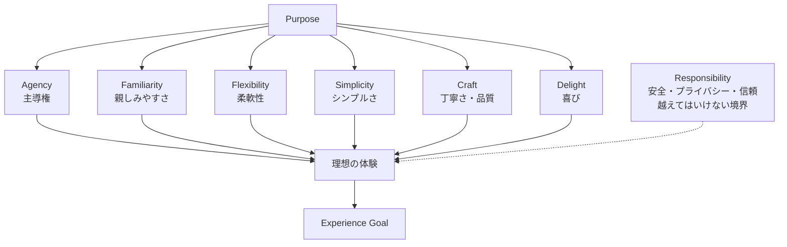

このデザインのあらゆる側面について、ユーザーが真に求める体験を描けるまで徹底的に質問してください。
仮説ツリーの各枝をたどり、決定事項間の依存関係を一つずつ解決していきましょう。
それぞれの質問に対して、あなたの推奨する回答を提示してください。

質問は一つずつしてください。

Apple Human Interface GuidelinesのDesign Principlesを
設計について考えるときに、見落としてはいけない問いとして使う。
原則をチェックリストとして網羅したり、すべてを最大化したりしない。
Purpose に照らして重要な原則を見極め、原則同士が衝突する場合はトレードオフを明らかにして優先順位を決める。

